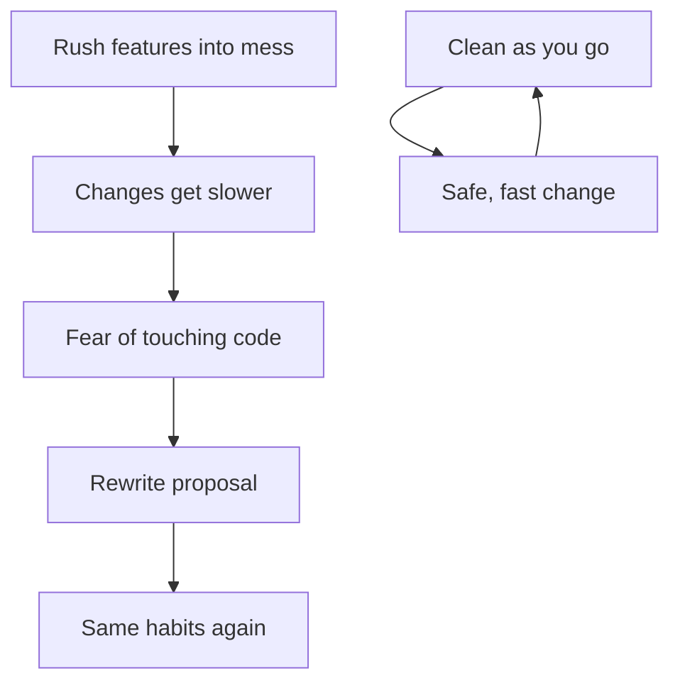
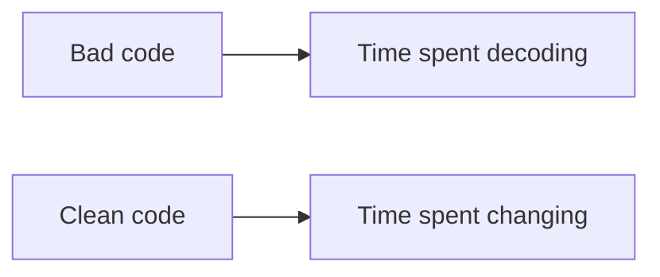

## Overview

Even bad code can run. The cost shows up later: every change gets slower, fear replaces confidence, and teams spend more time decoding than delivering. This chapter sets the attitude of the book: clean code is a professional practice, not a luxury pass after the deadline.

## Core ideas

### The cost of a mess

Mess does not buy speed. It burns productivity immediately. Features that used to take a day take a week. Estimates explode. Eventually someone proposes a grand rewrite, which usually reinvents the same habits in a new repo.

The primal conundrum managers push is: "We don't have time to do it right." True professionals know the opposite: the only way to go fast is to keep the code as clean as possible at all times.

### What "clean" means

People describe clean code in different ways. The overlapping points:

- **Focused**: does one thing well; dependencies stay minimal (Stroustrup)
- **Prose-like**: simple, direct, crisp abstractions (Booch)
- **Enhanceable**: others can change it; tests and a clear API exist (Thomas)
- **Cared for**: it looks like someone took responsibility (Feathers)
- **Simple design**: tests, no duplication, expresses intent, minimizes entities (Jeffries / Beck)
- **Surprising only in a good way**: each routine is pretty much what you expected (Cunningham)

### The Boy Scout Rule

Leave the campground cleaner than you found it. Small, continuous cleanups beat big-bang redesigns. A renamed variable, an extracted function, a deleted dead branch. Those compound.

## Visual





## Code Example

*Examples below are in Java.*

Opaque names force the next reader to reverse-engineer intent:

```java
public void p(List<int[]> a) {
  for (int[] x : a) {
    if (x[0] == 1) {
      x[1] = x[1] + 1;
    }
  }
}
```

The same behavior, written so the story is obvious:

```java
public void markFlaggedCellsAsVisited(List<Cell> board) {
  for (Cell cell : board) {
    if (cell.isFlagged()) {
      cell.markVisited();
    }
  }
}
```

## In short

Mess slows you down now, not later. Clean code is readable, tested, and focused enough that the next change does not feel scary. Leave files a bit better than you found them.
