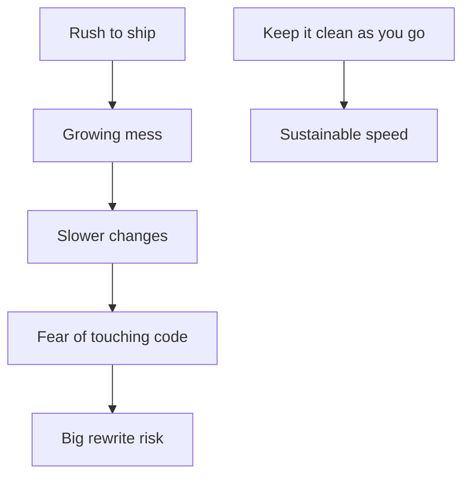

## Core ideas

Clean code is easy to read, easy to change, and clearly intentional. Mess does not save time — it burns productivity now and makes "cleanup later" a fantasy. Big-bang rewrites usually copy the same habits into a new repo.

What practitioners emphasize, taken together:

- Focused; does one thing well
- Simple and direct; reads like prose
- Enhanceable by others; covered by tests
- Looks like someone cared
- Tests, no duplication, expresses intent, minimizes entities
- Each routine is pretty much what you expected

Practice the Boy Scout Rule: leave every file a little cleaner than you found it.

## Picture



## Java

### Opaque and costly

```java
public void p(List<int[]> a) {
  for (int[] x : a) {
    if (x[0] == 1) {
      // do stuff
      x[1] = x[1] + 1;
    }
  }
}
```

### Clear intent

```java
public void markFlaggedCellsAsVisited(List<Cell> board) {
  for (Cell cell : board) {
    if (cell.isFlagged()) {
      cell.markVisited();
    }
  }
}
```

Same work, different future. The second version invites the next change without a scavenger hunt.

## Takeaways

- Going fast means staying clean, not skipping care
- Continuous small cleanups beat redesigns in the sky
- Names, tests, and focus are how care shows up in source
