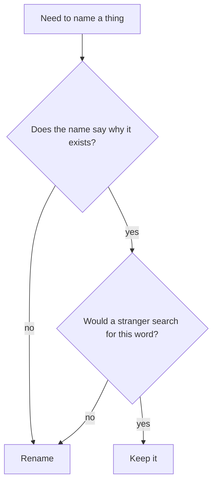
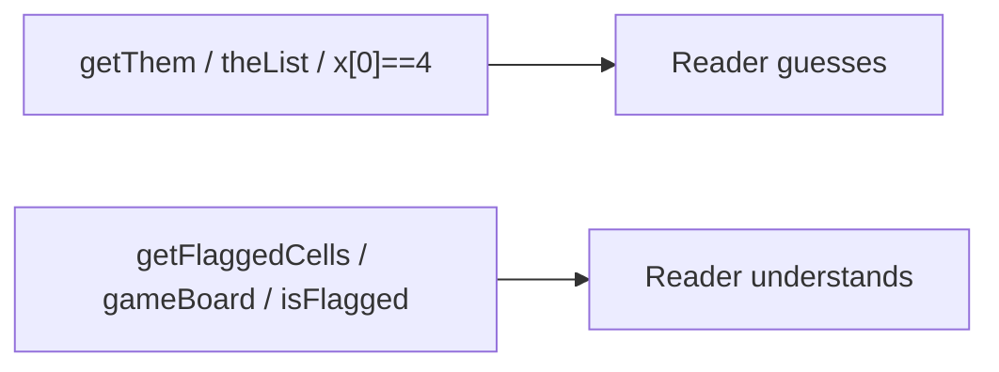

## What this chapter is about

Names are the primary documentation of a codebase. A good name answers why something exists, what it does, and how it is used. If you need a comment to explain a name, rename instead.

## Core ideas

### Intention-revealing names

Choose names that say what the code is doing at the business or problem level — not how the machine happens to store it. `elapsedTimeInDays` beats `d`. `flaggedCells` beats `list1`.

### Avoid disinformation

Do not call something a `list` if it is not a `List`. Do not reuse platform encodings (`hp`, `aix`) as casual abbreviations. Avoid lookalike characters (`O`/`0`, `l`/`1`) in identifiers.

### Make meaningful distinctions

Noise words are not distinctions: `ProductInfo` vs `ProductData` usually means you have not named the real difference. Numbered series (`a1`, `a2`) are non-informative. Redundant encodings (`nameString`, `CarObject`, `m_description`) add weight without meaning.

### Pronounceable, searchable, scoped

If you cannot say the name aloud, design discussions get awkward. Single-letter names are fine for tiny local scopes (`i` in a loop); longer scopes need precise names. The length of a name should scale with its lifetime and blast radius.

### Class and method shapes

- Classes / types → nouns or noun phrases (`Customer`, `WikiPage`, `AccountValidator`)
- Methods → verbs or verb phrases (`postPayment`, `isEmpty`, `save`)
- One word per concept: don't mix `fetch` / `retrieve` / `get` for the same idea across the codebase

### Context

Add context when bare names are ambiguous (`addrState` vs `state`). Drop gratuitous prefixes that repeat the class or module on every member (`MacroAirForcePlane_...`).

## Visual





## Code Example

*Examples below are in Java.*

Before — names hide the domain:

```java
public List<int[]> getThem() {
  List<int[]> list1 = new ArrayList<>();
  for (int[] x : theList) {
    if (x[0] == 4) {
      list1.add(x);
    }
  }
  return list1;
}
```

After — names carry the game rules:

```java
public List<Cell> getFlaggedCells() {
  List<Cell> flaggedCells = new ArrayList<>();
  for (Cell cell : gameBoard) {
    if (cell.isFlagged()) {
      flaggedCells.add(cell);
    }
  }
  return flaggedCells;
}
```

Encoding noise versus plain clarity:

```java
// Prefer
private String description;

// Over
private String m_dsc; // textual description
private String descriptionString;
```

## Takeaways

- Rename beats explaining with a comment
- Consistency of vocabulary matters as much as any single clever name
- Longer scope → more precise name
