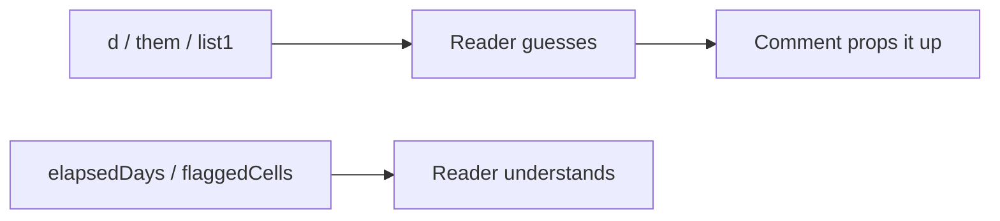

## Core ideas

Names are the primary documentation. They should answer why something exists, what it does, and how it is used. If you need a comment to explain a name, rename instead.

- Intention-revealing (`elapsedDays`, not `d`)
- No disinformation (`accountList` that is not a `List`)
- Meaningful distinctions — not `ProductInfo` vs `ProductData`
- Pronounceable and searchable; longer scope → more precise name
- Nouns for classes, verbs for methods
- One word per concept; consistent vocabulary
- Add meaningful context; drop gratuitous context

## Picture



## Code Example

<p class="notes-code-lang"><small>Language: Java</small></p>

### Before

```java
public List<int[]> getThem() {
  List<int[]> list1 = new ArrayList<>();
  for (int[] x : theList) {
    if (x[0] == 4) {
      list1.add(x);
    }
  }
  return list1;
}
```

### After

```java
public List<Cell> getFlaggedCells() {
  List<Cell> flagged = new ArrayList<>();
  for (Cell cell : gameBoard) {
    if (cell.isFlagged()) {
      flagged.add(cell);
    }
  }
  return flagged;
}
```

Noise words and encodings hide meaning:

```java
// Prefer
private String description;

// Over
private String m_dsc; // textual description
private String descriptionString;
```

## Takeaways

- Rename beats explaining
- Avoid cute, opaque, or inconsistent synonyms
- Context belongs in the name only when it clarifies
