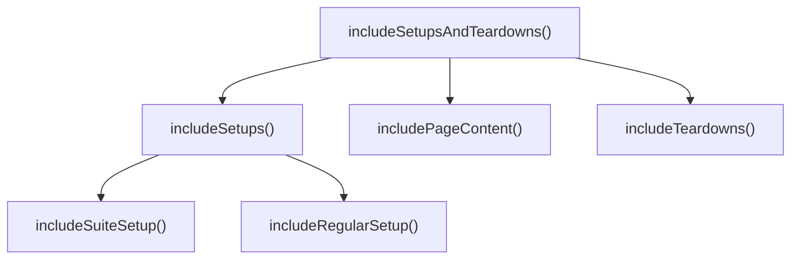

## Core ideas

Functions should be small, do one thing, and stay at one abstraction level.

- Stepdown rule: read top-down like a story — *to do X, do Y, then Z*
- Few arguments; group related args into objects
- No flag args, output args, or hidden side effects
- Command/query separation: mutate *or* query, not both
- Prefer exceptions over error-code ladders
- Bury `switch` once (often in a factory); prefer polymorphism elsewhere
- First drafts can be long — extract until the story is clear

## Picture



## Java

### Flag argument and mixed abstraction

```java
public void save(Employee e, boolean validate) {
  if (validate) {
    // validation details...
  }
  // persistence details mixed with orchestration
  db.insert(e);
}
```

### Split and name the intent

```java
public void save(Employee employee) {
  validate(employee);
  persist(employee);
}

public void saveWithoutValidation(Employee employee) {
  persist(employee);
}
```

### Switch → polymorphism

```java
// Switch lives once, at construction
public Employee make(EmployeeRecord record) {
  return switch (record.type()) {
    case COMMISSIONED -> new CommissionedEmployee(record);
    case HOURLY -> new HourlyEmployee(record);
    case SALARIED -> new SalariedEmployee(record);
  };
}

// Call sites stay clean
Money pay = employee.calculatePay();
```

### Command/query separation

```java
// Confusing: mutates and answers
if (attributeMap.set("username", "bob")) { }

// Clear
attributeMap.set("username", "bob");
if (attributeMap.contains("username")) { }
```

## Takeaways

- One thing, one level, few args
- Happy path should read linearly
- Extract until each function names a coherent unit of work
