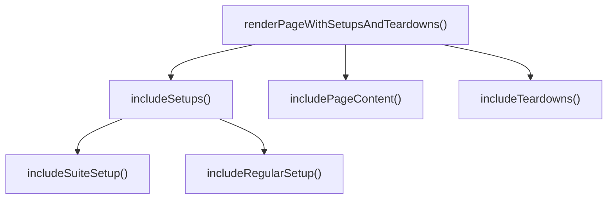
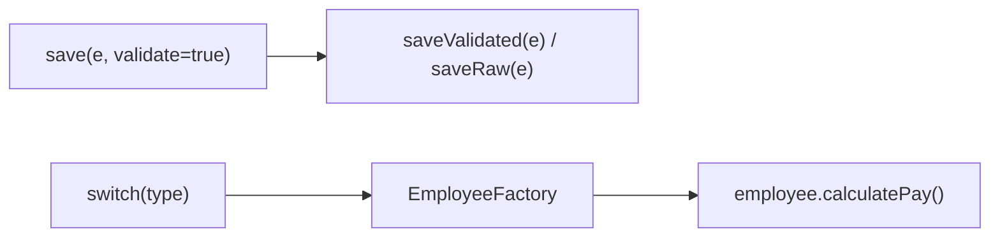

## What this chapter is about

Functions are the verbs of your system. They should be small, do one thing, and stay at one level of abstraction so a reader can follow the story from top to bottom.

## Core ideas

### Small, and then smaller

There is no hard line count, but when a function needs scroll, sections, or nested blocks, extract. Ideal blocks inside `if` / `else` / `while` are often a single named call. Indent depth beyond one or two levels is a smell.

### Do one thing

A function does one thing when you cannot extract another meaningful function from it without merely restating its implementation. Mixing setup, business rule, and persistence in one method is several things.

### One level of abstraction — the stepdown rule

Code should read like a narrative: *to do X, we do Y, then Z*. High-level steps call the next level down; they do not suddenly open sockets mid-paragraph.

### Arguments

Prefer fewer arguments. Zero is ideal; three is usually a stretch. Group related values into a small object (`Point` instead of `x, y`). Flag arguments (`boolean doSomething`) usually mean two functions. Avoid output arguments and hidden side effects.

### Command / query separation

A function should change state **or** answer a question — not both. `if (set("username", "bob"))` confuses mutation with inquiry.

### Prefer exceptions to error codes

Error-code ladders nest and obscure the happy path. Exceptions let success read linearly; handle failure in `catch` / dedicated handlers.

### Switch statements

You cannot always delete `switch`, but you can bury it once (often in a factory) and use polymorphism at call sites so adding a type does not edit every switch in the app.

### Draft, then extract

First versions can be long. Refactor with tests: extract, rename, restructure until each function names a coherent unit of work.

## Visual





## Code Example

*Examples below are in Java.*

Flag argument and mixed abstraction:

```java
public void save(Employee e, boolean validate) {
  if (validate) { /* validation details... */ }
  db.insert(e); // persistence mixed with orchestration
}
```

Split by intent:

```java
public void save(Employee employee) {
  validate(employee);
  persist(employee);
}

public void saveWithoutValidation(Employee employee) {
  persist(employee);
}
```

Switch buried at construction; call sites stay clean:

```java
public Employee make(EmployeeRecord record) {
  return switch (record.type()) {
    case COMMISSIONED -> new CommissionedEmployee(record);
    case HOURLY -> new HourlyEmployee(record);
    case SALARIED -> new SalariedEmployee(record);
  };
}

Money pay = employee.calculatePay();
```

## Takeaways

- One thing, one abstraction level, few arguments
- Happy path should read as a straight story
- Extract until names carry the design
