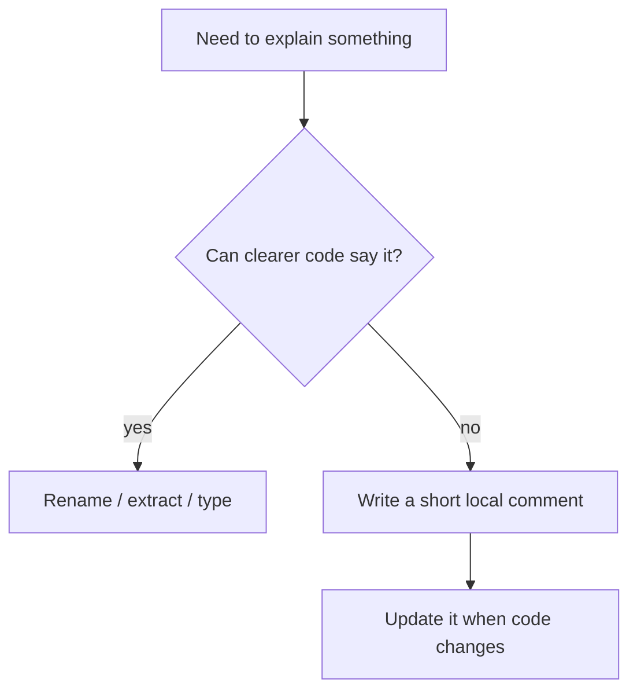

## What this chapter is about

Comments are not a strategy for unclear code. They compensate when the language cannot express intent cleanly. Every comment is a maintenance liability: if the code changes and the comment does not, you now have a lie.

## Core ideas

### Prefer expressive code

Before writing a comment, try a better name, a smaller function, or a type that makes the illegal state unrepresentable. Many "explanatory" comments are missing abstractions in disguise.

### Comments that help

- Legal / copyright headers required by policy
- Warnings of non-obvious consequences ("this closes the socket")
- Clarifying intent that still cannot fit in a name
- Public API documentation for callers outside the module
- TODOs with ownership and enough context to act

### Comments that hurt

- Restating what the next line already says
- Journal / changelog comments (use version control)
- Noise mandated by process templates
- Commented-out code (delete it; git remembers)
- HTML banners and position markers
- Misleading or obsolete notes — worse than silence

### Keep comments local and honest

A good comment is close to the code it describes and updated in the same change. If you cannot afford to maintain it, do not write it.

## Visual



## Code Example

*Examples below are in Java.*

Redundant comment propping up opaque logic:

```java
// Check to see if the employee is eligible for full benefits
if ((employee.flags & HOURLY) != 0 && employee.age > 65) {
  // ...
}
```

Intent moved into the code:

```java
if (employee.isEligibleForFullBenefits()) {
  // ...
}
```

Comments that earn their place:

```java
/**
 * Balance after pending settlements.
 * Soft-holds from fraud review are excluded on purpose.
 */
public Money availableBalance() { /* ... */ }

// Vendor returns HTTP 200 with an empty body when throttled.
return vendorClient.fetchRates();
```

## Takeaways

- Code first; comments for what code cannot say cleanly
- Delete commented-out code
- A wrong comment is worse than no comment
