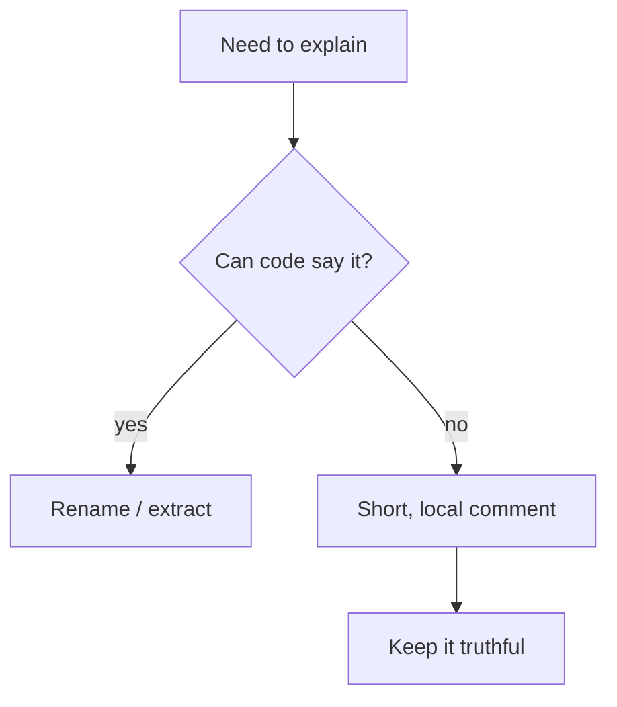

## Core ideas

Comments compensate for failure to express ourselves in code. Prefer clearer names and structure. When you do write a comment, maintain it like code.

Helpful: legal headers, non-obvious intent/warnings, TODOs with ownership, public API docs.

Harmful: restating the obvious, outdated notes, mandated noise, journal comments, commented-out code, position banners.

## Picture



## Java

### Redundant / lying comment

```java
// Check to see if the employee is eligible for full benefits
if ((employee.flags & HOURLY) != 0 && employee.age > 65) {
  // ...
}
```

### Express it in code

```java
if (employee.isEligibleForFullBenefits()) {
  // ...
}
```

### Comments that earn their place

```java
/**
 * Returns the balance after pending settlements.
 * Does not include soft-holds from fraud review.
 */
public Money availableBalance() { /* ... */ }

// Failure mode: vendor returns 200 with an empty body on throttle.
return vendorClient.fetchRates();
```

## Takeaways

- Code first; comments for what code cannot say cleanly
- Delete commented-out code — git remembers
- A wrong comment is worse than no comment
