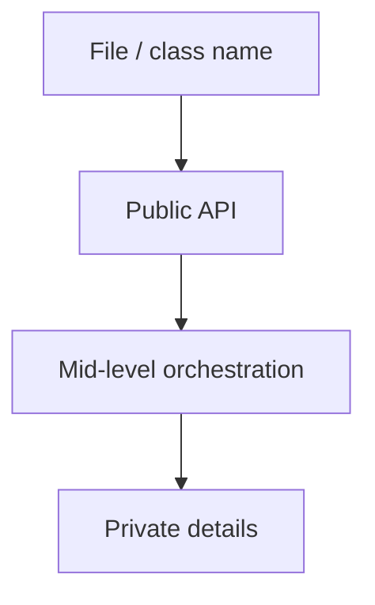
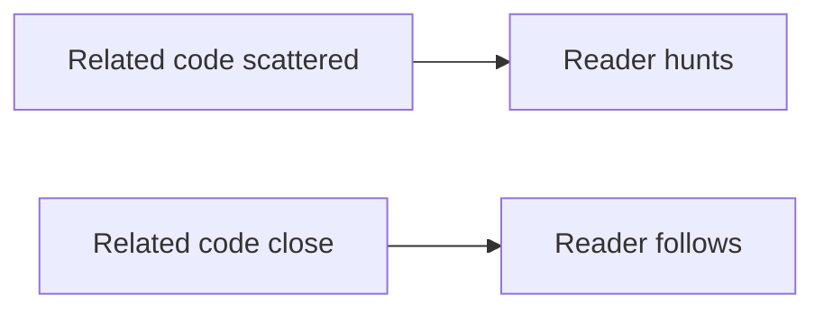

## Overview

Formatting is communication. Readers form an opinion about the care behind the code long before they understand the algorithms. Consistent layout lets the eye find structure without fighting noise.

## Core ideas

### The newspaper metaphor

A source file should read like a news article: headline (name) at the top, high-level synopsis next, details further down. Public API first; helpers and low-level details later.

### Vertical formatting

- Related concepts stay close; blank lines separate ideas
- Dependent functions follow the functions they support when it aids reading
- Concepts that change together appear together
- File length should stay scannable, huge files hide structure

### Conceptual affinity

Things that are strongly related (a public method and the private helpers it uses, fields that form one concept) should sit near each other. Formatting is partly about affinity: the eye should not travel far to finish one thought.

### Horizontal formatting

Indentation shows hierarchy. Avoid packing multiple statements onto one line. Alignment tricks are optional; consistency beats clever columns. Let a formatter own whitespace debates so reviews discuss design.

### Team rules

Personal preference loses to shared style. Automate with Checkstyle, Spotless, Prettier, `gofmt`, etc. The point is a single heartbeat for the codebase, not moral victory for tabs or spaces.

## Visual





## Code Example

*Examples below are in Java.*

Scattered density:

```java
public class Report {
  private final Clock clock; private Repository repo;
  public Report(Repository repo,Clock clock){this.repo=repo;this.clock=clock;}
  private String fmt(Instant t){ return DateTimeFormatter.ISO_INSTANT.format(t); }
  public String run(String id){ var row=repo.find(id); return fmt(clock.instant())+" "+row; }
}
```

Newspaper layout: story first, helpers below:

```java
public class Report {
  private final Repository repository;
  private final Clock clock;

  public Report(Repository repository, Clock clock) {
    this.repository = repository;
    this.clock = clock;
  }

  public String run(String id) {
    Row row = repository.find(id);
    return timestamp() + " " + row;
  }

  private String timestamp() {
    return DateTimeFormatter.ISO_INSTANT.format(clock.instant());
  }
}
```

## In short

Put related code close together. Pick one team style and automate it so reviews talk about behavior, not spaces.
