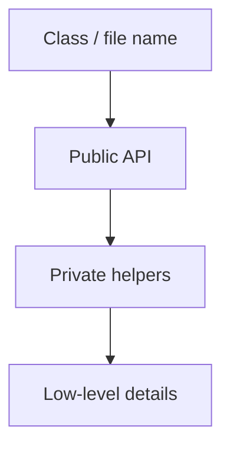

## Core ideas

Formatting is communication. Readers judge care before they understand logic.

- Newspaper metaphor: headline (name) → synopsis (high level) → details downward
- Related concepts stay close; vertical density for coherent ideas
- Dependents follow dependencies when it aids reading
- Horizontal clarity: indent hierarchy; avoid packed lines
- Team style beats personal preference — automate with a formatter

## Picture



## Code Example

<p class="notes-code-lang"><small>Language: Java</small></p>

### Scattered and noisy

```java
public class Report {
  private final Clock clock; private Repository repo;
  public Report(Repository repo,Clock clock){this.repo=repo;this.clock=clock;}
  private String fmt(Instant t){ return DateTimeFormatter.ISO_INSTANT.format(t); }
  public String run(String id){ var row=repo.find(id); return fmt(clock.instant())+" "+row; }
}
```

### Newspaper layout

```java
public class Report {
  private final Repository repository;
  private final Clock clock;

  public Report(Repository repository, Clock clock) {
    this.repository = repository;
    this.clock = clock;
  }

  public String run(String id) {
    Row row = repository.find(id);
    return timestamp() + " " + row;
  }

  private String timestamp() {
    return DateTimeFormatter.ISO_INSTANT.format(clock.instant());
  }
}
```

## Takeaways

- Vertical openness and proximity guide the eye
- Consistency > clever alignment
- Let tools own whitespace debates
