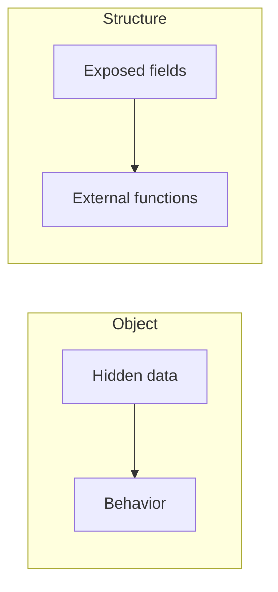
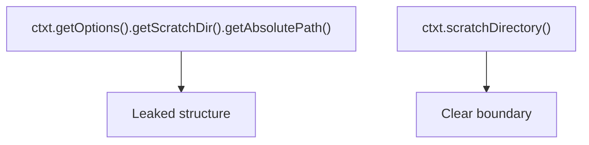

## Overview

Objects and data structures are complementary tools. Confusing them produces hybrids that expose guts *and* pretend to encapsulate behavior, usually the worst of both worlds.

## Core ideas

### Objects hide; structures expose

- **Objects** hide data behind abstractions and expose methods that operate on that data
- **Data structures** expose data and have little meaningful behavior; functions outside operate on them

### Complementary strengths

Object-oriented style makes it easy to add new types without changing existing functions, but harder to add new operations across all types. Procedural / data-structure style makes it easy to add functions over existing structures, but harder to add new structures without editing those functions. Choose based on which axis of change you expect.

### Data abstraction

Hiding fields is not enough, expose *policy*, not storage. An interface that forces setting coordinates atomically (Cartesian or polar) abstracts better than public `x`/`y` fields.

### Law of Demeter

A method should talk to its own object, its parameters, objects it creates, and its direct components, not walk a train of getters (`a.getB().getC().doThing()`). Train wrecks mean structure has leaked. Prefer telling an object to do work over asking it for parts.

### Data/object anti-symmetry

This is the same idea as the complementary strengths above: you optimize either for adding types or for adding operations. Fighting the grain of that choice is where hybrids appear.

### Hybrids and DTOs

DTOs (and similar "beans") are structures: public fields or getters/setters with almost no behavior. Fine at boundaries. Trouble starts when a DTO grows business rules while still exposing every field, or when an "object" leaks its guts and still claims encapsulation. Be deliberate: bag of fields at the edge, or type that owns invariants.

## Visual





## Code Example

*Examples below are in Java.*

Concrete structure vs abstract interface:

```java
public class Point {
  public double x;
  public double y;
}

public interface Point {
  double getX();
  double getY();
  void setCartesian(double x, double y);
  double getR();
  double getTheta();
  void setPolar(double r, double theta);
}
```

Train wreck versus tell-don't-ask:

```java
String path = ctxt.getOptions().getScratchDir().getAbsolutePath();

Path path = ctxt.scratchDirectory();
ctxt.writeScratchFile(name, bytes);
```

## In short

Objects hide data and expose behavior. Data structures do the opposite. Pick based on what will change. Avoid getter trains.
