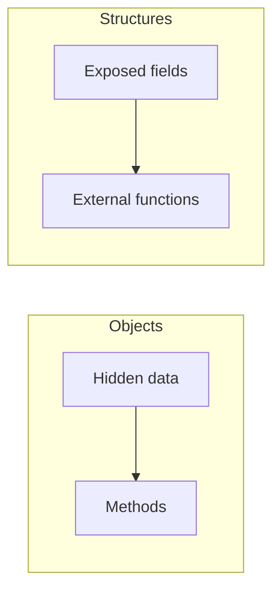

## Core ideas

Objects hide data and expose behavior. Data structures expose data and have little behavior.

- OO style: easy to add types; harder to add functions across all types
- Procedural style: easy to add functions; harder to add structures
- Hybrids (half-exposed guts + "object" claims) are usually worst
- Law of Demeter: talk to friends, not strangers — avoid train wrecks
- Prefer telling an object to do work over asking for its innards

## Picture



## Code Example

<p class="notes-code-lang"><small>Language: Java</small></p>

### Concrete structure vs abstract interface

```java
// Structure: representation leaks
public class Point {
  public double x;
  public double y;
}

// Abstraction: policy without exposing storage
public interface Point {
  double getX();
  double getY();
  void setCartesian(double x, double y);
  double getR();
  double getTheta();
  void setPolar(double r, double theta);
}
```

### Train wreck (Demeter violation)

```java
String path = ctxt.getOptions().getScratchDir().getAbsolutePath();
```

### Tell, don't ask

```java
// Prefer a clear boundary on the context
Path path = ctxt.scratchDirectory();
// or push the work inward
ctxt.writeScratchFile(name, bytes);
```

## Takeaways

- Choose object vs structure deliberately for the kind of change you expect
- Don't pass boundary types (`Map`, DTOs) through the whole system
- Train wrecks mean leaked structure
