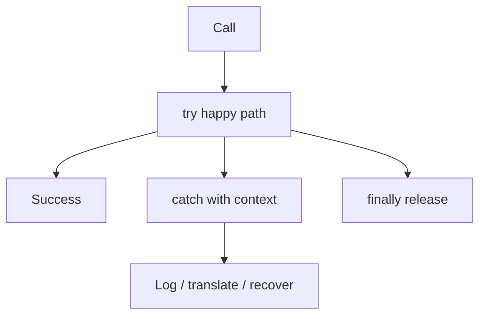

## Core ideas

Error handling matters — and must not obscure business logic.

- Prefer exceptions over return codes and flag soup
- Write `try` / `catch` / `finally` first to define the scope
- Provide context in exceptions (what, with which input, why it matters)
- Define exception types by how callers must handle them
- Don't return `null`; don't pass `null` when avoidable
- Wrap third-party failures at the boundary

## Picture



## Java

### Error codes bury the story

```java
public void sendShutDown() {
  DeviceHandle handle = getHandle(DEV1);
  if (handle != DeviceHandle.INVALID) {
    DeviceRecord record = retrieveDeviceRecord(handle);
    if (record.getStatus() != DEVICE_SUSPENDED) {
      pauseDevice(handle);
      clearDeviceWorkQueue(handle);
      closeDevice(handle);
    } else {
      logger.log("Device suspended");
    }
  } else {
    logger.log("Invalid handle");
  }
}
```

### Exceptions keep the happy path linear

```java
public void sendShutDown() {
  try {
    tryToShutDown();
  } catch (DeviceShutDownError error) {
    logger.log(error);
  }
}

private void tryToShutDown() {
  DeviceHandle handle = getHandle(DEV1);
  DeviceRecord record = retrieveDeviceRecord(handle);
  pauseDevice(handle);
  clearDeviceWorkQueue(handle);
  closeDevice(handle);
}
```

### Prefer empty / Optional over null

```java
// Fragile
public List<Employee> getEmployees() {
  if (noEmployees()) return null;
  return employees;
}

// Honest
public List<Employee> getEmployees() {
  if (noEmployees()) return List.of();
  return employees;
}
```

## Takeaways

- Separate happy path from failure path
- Context-rich exceptions beat bare codes
- Null pushes crashes to someone else's stack
