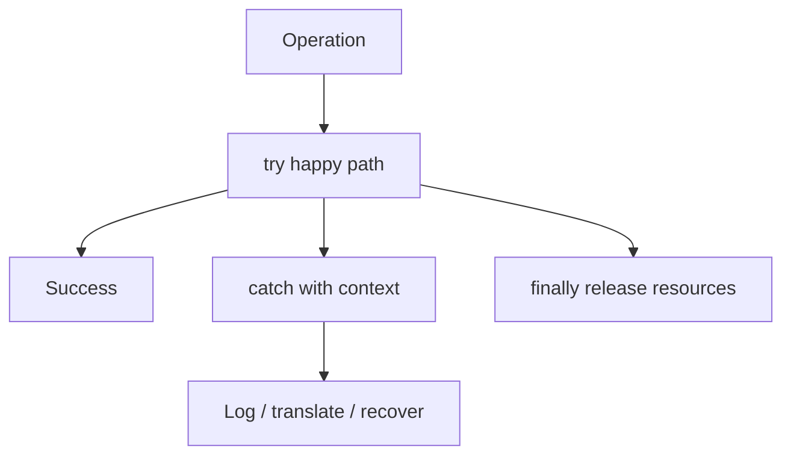
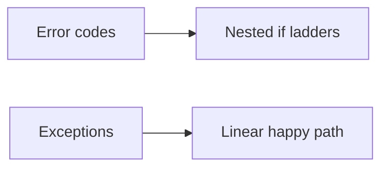

## What this chapter is about

Error handling is important enough to deserve its own attention — and important enough not to clutter business logic. If failure handling obscures what the code is supposed to do on the happy path, the design is wrong.

## Core ideas

### Prefer exceptions to return codes

Return codes and status flags force every caller to check immediately, nesting the real work inside error ladders. Exceptions separate the success story from recovery.

### Write try / catch / finally first

When a block can fail, start by defining the scope: what must happen on success, what recovery looks like, and what always releases (files, locks, connections). That scope teaches callers what to expect.

### Provide context

Bare exceptions waste time. Include what operation failed, which inputs mattered, and enough state to diagnose without a debugger séance.

### Define exceptions by caller need

Classify errors by how callers must respond (retryable network fault vs permanent validation failure), not by every internal throw site.

### Don't return or pass null

`null` pushes crashes downstream and forces noisy checks. Prefer empty collections, `Optional`, special-case objects, or exceptions at the boundary.

### Wrap third-party failures

At module edges, translate foreign exceptions into your types so the rest of the system does not depend on vendor error models.

## Visual





## Code Example

*Examples below are in Java.*

Error codes bury the story:

```java
public void sendShutDown() {
  DeviceHandle handle = getHandle(DEV1);
  if (handle != DeviceHandle.INVALID) {
    DeviceRecord record = retrieveDeviceRecord(handle);
    if (record.getStatus() != DEVICE_SUSPENDED) {
      pauseDevice(handle);
      clearDeviceWorkQueue(handle);
      closeDevice(handle);
    } else {
      logger.log("Device suspended");
    }
  } else {
    logger.log("Invalid handle");
  }
}
```

Exceptions keep the happy path linear:

```java
public void sendShutDown() {
  try {
    tryToShutDown();
  } catch (DeviceShutDownError error) {
    logger.log(error);
  }
}

private void tryToShutDown() {
  DeviceHandle handle = getHandle(DEV1);
  DeviceRecord record = retrieveDeviceRecord(handle);
  pauseDevice(handle);
  clearDeviceWorkQueue(handle);
  closeDevice(handle);
}
```

Prefer empty results over null:

```java
public List<Employee> getEmployees() {
  if (noEmployees()) {
    return List.of();
  }
  return employees;
}
```

## Takeaways

- Separate happy path from failure path
- Context-rich exceptions beat bare codes and nulls
- Define error types for the caller, not the thrower
