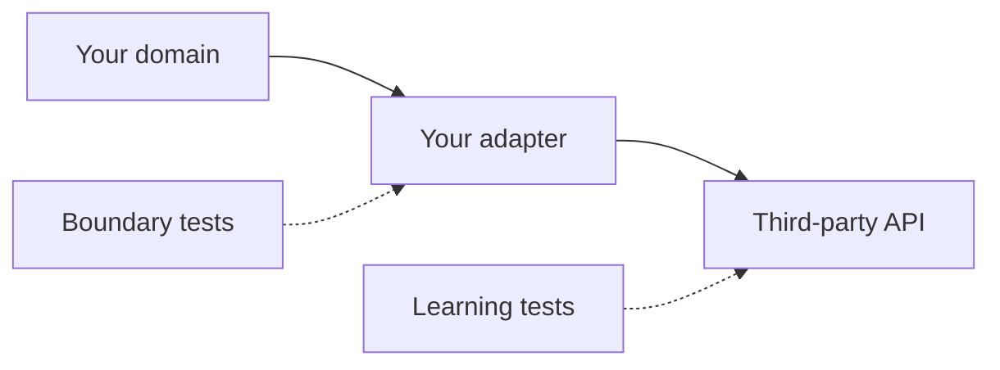

## What this chapter is about

Third-party libraries, vendor APIs, and legacy modules are not under your control. Clean systems meet them at a deliberate boundary so the rest of the code depends on interfaces you own.

## Core ideas

### Wrap what you do not control

Adapters translate foreign types into your vocabulary. The rest of the app talks to `Sensors`, not `Map<String, Sensor>` sprinkled everywhere. When the vendor changes, you change one place.

### Do not pass boundary types through the system

Maps, vendor DTOs, and SDK clients are fine at the edge. Dragging them into domain logic couples your core to someone else's release notes.

### Learning tests

Write small tests that encode how a library actually behaves. They teach the API, document assumptions, and fail loudly when an upgrade changes semantics — cheaper than rediscovering behavior in production.

### Clean boundaries are tested boundaries

Outbound tests should exercise the interface the same way production code does. Good boundaries accommodate change without huge rework.

## Visual



## Code Example

*Examples below are in Java.*

Leaking a boundary type:

```java
Map<String, Sensor> sensors = new HashMap<>();
Sensor sensor = sensors.get(sensorId);
```

Encapsulate the boundary:

```java
public class Sensors {
  private final Map<String, Sensor> sensors = new HashMap<>();

  public Sensor getById(String id) {
    return sensors.get(id);
  }

  public void put(Sensor sensor) {
    sensors.put(sensor.id(), sensor);
  }
}
```

Learning-test sketch:

```java
@Test
void log4jWritesToMemoryAppender() {
  Logger logger = Logger.getLogger("test");
  MemoryAppender appender = new MemoryAppender();
  logger.addAppender(appender);
  logger.info("hello");
  assertThat(appender.messages()).contains("hello");
}
```

## Takeaways

- Own the interface; rent the implementation
- Confine foreign types to the edge
- Learning tests are cheap insurance against upgrades
