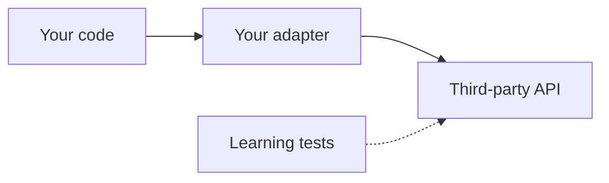

## Core ideas

Third-party and legacy code should meet your system at a clear boundary.

- Wrap foreign APIs so the rest of the app depends on *your* interface
- Don't pass boundary types (`Map`, vendor DTOs) everywhere
- Learning tests encode how a library behaves — cheap upgrade insurance
- Outbound tests at the boundary define expected behavior

## Picture



## Code Example

<p class="notes-code-lang"><small>Language: Java</small></p>

### Leaking a boundary type

```java
Map<String, Sensor> sensors = new HashMap<>();
Sensor sensor = sensors.get(sensorId);
```

### Encapsulate the boundary

```java
public class Sensors {
  private final Map<String, Sensor> sensors = new HashMap<>();

  public Sensor getById(String id) {
    return sensors.get(id);
  }

  public void put(Sensor sensor) {
    sensors.put(sensor.id(), sensor);
  }
}
```

### Learning test sketch

```java
@Test
void log4jLogsToMemoryAppender() {
  Logger logger = Logger.getLogger("test");
  MemoryAppender appender = new MemoryAppender();
  logger.addAppender(appender);
  logger.info("hello");
  assertThat(appender.messages()).contains("hello");
}
```

## Takeaways

- Own the interface; rent the implementation
- Boundaries need tests that speak *your* usage
- Fewer maintenance points when vendors change
