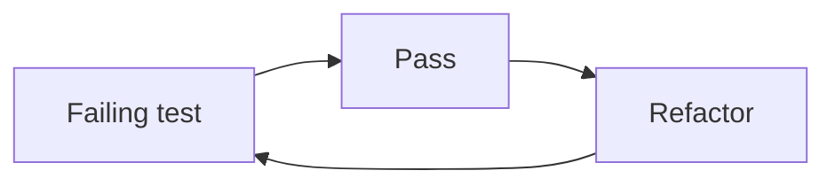

## Core ideas

Tests keep clean code clean under change. Test code is first-class — dirty tests rot and get deleted, then production freezes.

Three laws of TDD:

1. No production code until a failing unit test exists
2. Write only enough test to fail (not compiling counts)
3. Write only enough production code to pass

FIRST: Fast, Independent, Repeatable, Self-validating, Timely.

Readability is the top virtue: clarity, simplicity, density. Prefer domain helpers so tests read as arrange / act / assert.

## Picture



## Code Example

<p class="notes-code-lang"><small>Language: Java</small></p>

### Detail-heavy test

```java
@Test
void pageHierarchyAsXml() throws Exception {
  crawler.addPage(root, PathParser.parse("PageOne"));
  crawler.addPage(root, PathParser.parse("PageOne.ChildOne"));
  crawler.addPage(root, PathParser.parse("PageTwo"));
  request.setResource("root");
  request.addInput("type", "pages");
  Responder responder = new SerializedPageResponder();
  SimpleResponse response =
      (SimpleResponse) responder.makeResponse(new FitNesseContext(root), request);
  assertEquals("text/xml", response.getContentType());
  assertTrue(response.getContent().contains("<name>PageOne</name>"));
}
```

### Domain-language test

```java
@Test
void pageHierarchyAsXml() {
  makePages("PageOne", "PageOne.ChildOne", "PageTwo");
  submitRequest("root", "type:pages");
  assertResponseIsXml();
  assertResponseContains(
      "<name>PageOne</name>",
      "<name>PageTwo</name>",
      "<name>ChildOne</name>");
}
```

## Takeaways

- Keep tests as clean as production
- One concept per test; helpers beat copy-paste setup
- Confidence to change is the goal, not vanity coverage
