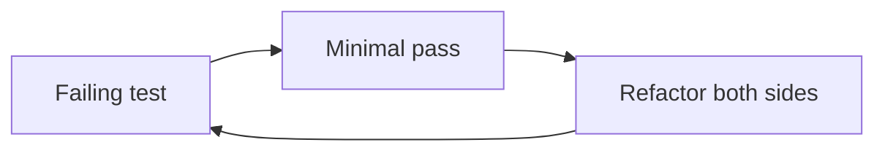
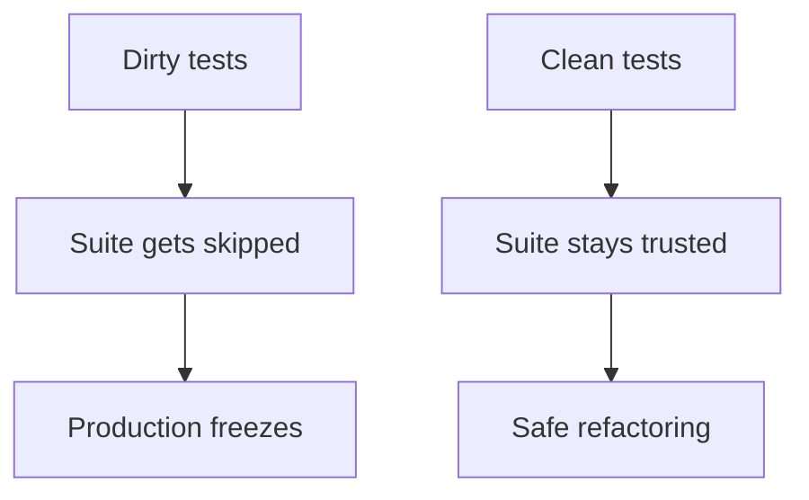

## Overview

Tests are what keep clean production code clean under change. Without them, every cleanup is a gamble. Test code is not a second-class citizen, dirty tests rot, get deleted, and then the production code freezes.

## Core ideas

### Three laws of TDD

1. You may not write production code until you have a failing unit test
2. You may not write more of a unit test than is sufficient to fail (not compiling counts as failing)
3. You may not write more production code than is sufficient to pass the currently failing test

The rhythm is short: fail → pass → refactor. Both sides stay clean.

### FIRST

- **Fast**: slow suites do not get run
- **Independent**: order and shared mutable state should not matter
- **Repeatable**: any environment, same result
- **Self-validating**: pass/fail without manual inspection
- **Timely**: written close to the production code (ideally first)

### Clean tests

Readability is the top virtue: clarity, simplicity, density of expression. Build domain-specific helpers so tests read as arrange / act / assert instead of API noise. One assert per concept; one concept per test.

### Domain-specific testing language

Build tiny helpers named in the language of the feature (`makePages`, `submitRequest`, `assertResponseIsXml`). The suite becomes documentation. That is what "clean tests" usually look like in practice, not a pile of framework calls.

### Coverage vs confidence

Coverage numbers are lagging indicators. The goal is confidence to change behavior without fear.

## Visual





## Code Example

*Examples below are in Java.*

Detail-heavy test, hard to see the intent:

```java
@Test
void pageHierarchyAsXml() throws Exception {
  crawler.addPage(root, PathParser.parse("PageOne"));
  crawler.addPage(root, PathParser.parse("PageOne.ChildOne"));
  request.setResource("root");
  request.addInput("type", "pages");
  Responder responder = new SerializedPageResponder();
  SimpleResponse response =
      (SimpleResponse) responder.makeResponse(new FitNesseContext(root), request);
  assertEquals("text/xml", response.getContentType());
  assertTrue(response.getContent().contains("<name>PageOne</name>"));
}
```

Domain-language test:

```java
@Test
void pageHierarchyAsXml() {
  makePages("PageOne", "PageOne.ChildOne", "PageTwo");
  submitRequest("root", "type:pages");
  assertResponseIsXml();
  assertResponseContains(
      "<name>PageOne</name>",
      "<name>PageTwo</name>",
      "<name>ChildOne</name>");
}
```

## In short

Treat tests like production code. Keep the red-green-refactor loop short. Prefer readable helpers over copy-pasted setup.
