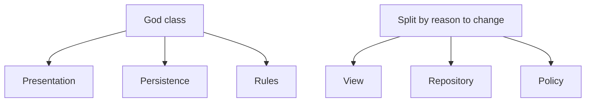

## Core ideas

Classes should be small and have one reason to change (SRP).

- Typical order: statics → fields → publics → private helpers
- Size is about responsibilities, not only line count
- If you need "and/or/if/but" to describe the class in ~25 words, split it
- High cohesion: methods share the fields they use
- Maintaining cohesion often means *more* small classes
- Organize for change; hide internals behind a small API

## Picture



## Code Example

<p class="notes-code-lang"><small>Language: Java</small></p>

### Too many reasons to change

```java
public class Employee {
  public Money calculatePay() { /* payroll rules */ }
  public void save() { /* database */ }
  public String reportHtml() { /* UI formatting */ }
}
```

### One responsibility each

```java
public class Employee {
  public Money calculatePay() { /* payroll rules */ }
}

public class EmployeeRepository {
  public void save(Employee employee) { /* database */ }
}

public class EmployeeReporter {
  public String toHtml(Employee employee) { /* UI formatting */ }
}
```

## Takeaways

- Name the responsibility; if the name needs "and", split
- Prefer many small cohesive classes over one kitchen sink
- Get green, then reshape toward SRP
