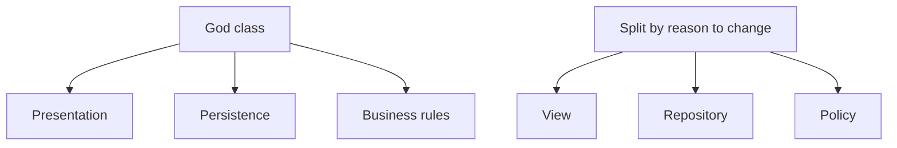

## Overview

Classes organize functions and data. Like functions, they should be small, measured primarily by **responsibility**, not line count. The Single Responsibility Principle (SRP) is the guiding constraint: one reason to change.

## Core ideas

### Organization

A common, readable order: static constants → static variables → instance variables → public methods → private helpers used by those publics. Prefer keeping encapsulation; loosen visibility only as a last resort.

### Small classes and SRP

A class name should describe its responsibility. If you need "and", "or", "if", or "but" to describe it in about twenty-five words, it is doing too much. God classes with dozens of methods are a smell even when each method looks fine alone.

### Cohesion

High cohesion means methods share the fields they use. Few instance variables help. Maintaining cohesion often produces *more* small classes rather than fewer large ones, that is a feature.

### Open/closed where it pays

Classes should be open for extension and closed for modification when you have a stable axis of change (new report formats, new payment types). Do not invent plugin architecture for a one-off. OCP is a response to repeated change, not a default template.

### Organizing for change

Isolate what varies. Prefer designs that are open for extension and closed for modification where the extension points earn their keep. Hide internals behind a small, intention-revealing API.

### Get green, then shape

First make it work. Then refactor toward SRP before the class grows roots through the system.

## Visual



## Code Example

*Examples below are in Java.*

Too many reasons to change in one type:

```java
public class Employee {
  public Money calculatePay() { /* payroll rules */ }
  public void save() { /* database */ }
  public String reportHtml() { /* UI formatting */ }
}
```

One responsibility each:

```java
public class Employee {
  public Money calculatePay() { /* payroll rules */ }
}

public class EmployeeRepository {
  public void save(Employee employee) { /* database */ }
}

public class EmployeeReporter {
  public String toHtml(Employee employee) { /* UI formatting */ }
}
```

## In short

One reason to change per class. If the name needs "and", split it. High cohesion usually means more small classes, not fewer big ones.
