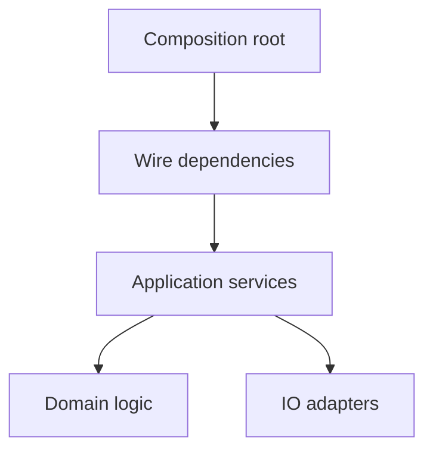

## Core ideas

At system scale, cleanliness is separation of concerns: construction vs use, modular wiring, and growth without tribal knowledge.

- Separate building the object graph from running business logic
- Dependency injection / factories keep startup wiring explicit
- Cross-cutting concerns (logging, transactions, security) need clear mechanisms
- Optimize for clarity and testability; premature infrastructure is still premature
- Test-drive architecture the same way you test-drive modules

## Picture



## Code Example

<p class="notes-code-lang"><small>Language: Java</small></p>

### Construction mixed into use

```java
public class OrderService {
  public void place(Order order) {
    Repository repo = new JdbcRepository(DriverManager.getConnection(url));
    repo.save(order);
    new SmtpNotifier().send(order.email());
  }
}
```

### Injected collaborators

```java
public class OrderService {
  private final OrderRepository repository;
  private final Notifier notifier;

  public OrderService(OrderRepository repository, Notifier notifier) {
    this.repository = repository;
    this.notifier = notifier;
  }

  public void place(Order order) {
    repository.save(order);
    notifier.send(order.email());
  }
}
```

## Takeaways

- One place builds; many places use
- Depend on abstractions you own at module edges
- A clean system is navigable without folklore
