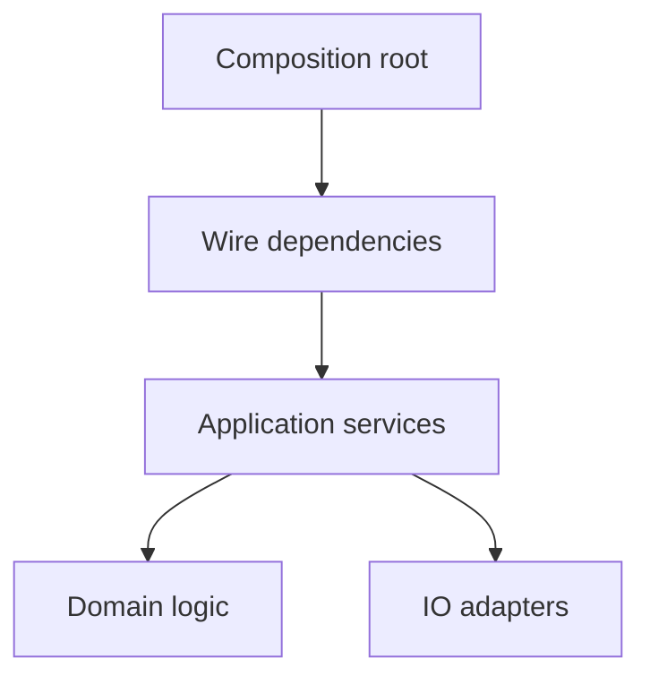
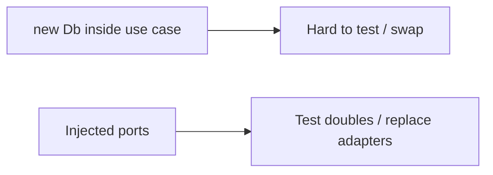

## What this chapter is about

At system scale, cleanliness is about separation of concerns: how the whole is constructed, wired, and allowed to evolve without tribal knowledge.

## Core ideas

### Construction vs use

Building the object graph is a different concern from running business logic. A composition root (main, DI container, factory module) wires dependencies; application services then use abstractions without `new`-ing infrastructure mid-flow.

### Dependency injection

Inject collaborators so modules depend on interfaces they need, not on concrete construction details. That keeps startup wiring explicit and units testable.

### Cross-cutting concerns

Logging, transactions, security, and similar concerns need clear mechanisms (decorators, aspects, middleware) — not copy-paste through every use case.

### Growth without folklore

A clean system stays navigable as it scales. Optimize for clarity and testability first; premature infrastructure platforms are still premature. Test-drive architecture the same way you test-drive modules: small proofs, then expand.

## Visual





## Code Example

*Examples below are in Java.*

Construction mixed into use:

```java
public class OrderService {
  public void place(Order order) {
    Repository repo = new JdbcRepository(DriverManager.getConnection(url));
    repo.save(order);
    new SmtpNotifier().send(order.email());
  }
}
```

Injected collaborators:

```java
public class OrderService {
  private final OrderRepository repository;
  private final Notifier notifier;

  public OrderService(OrderRepository repository, Notifier notifier) {
    this.repository = repository;
    this.notifier = notifier;
  }

  public void place(Order order) {
    repository.save(order);
    notifier.send(order.email());
  }
}
```

## Takeaways

- One place builds; many places use
- Depend on abstractions you own at module edges
- A clean system is navigable without folklore
