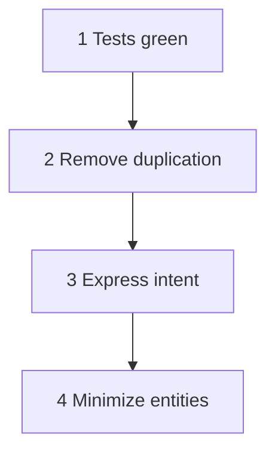

## Core ideas

Kent Beck's four rules of simple design, in priority order:

1. Runs all the tests
2. Contains no duplication
3. Expresses the intent of the programmers
4. Minimizes classes and methods

Simple design *emerges* from following these under continuous refactoring. You do not invent the perfect architecture up front — you apply pressure toward clarity.

Duplication often means an abstraction is waiting. Extract when the duplication is real, not speculative.

## Picture



## Code Example

<p class="notes-code-lang"><small>Language: Java</small></p>

### Duplication hiding an idea

```java
double area1 = length * width;
double area2 = radius * radius * Math.PI;
// later, same formulas copy-pasted in pricing, reports, UI...
```

### Named design idea

```java
public interface Shape {
  double area();
}

public record Rectangle(double length, double width) implements Shape {
  public double area() { return length * width; }
}

public record Circle(double radius) implements Shape {
  public double area() { return Math.PI * radius * radius; }
}
```

## Takeaways

- Priority order matters: tests first, minimalism last
- Expressiveness beats premature abstraction
- Refactor until the design is obvious in the names
