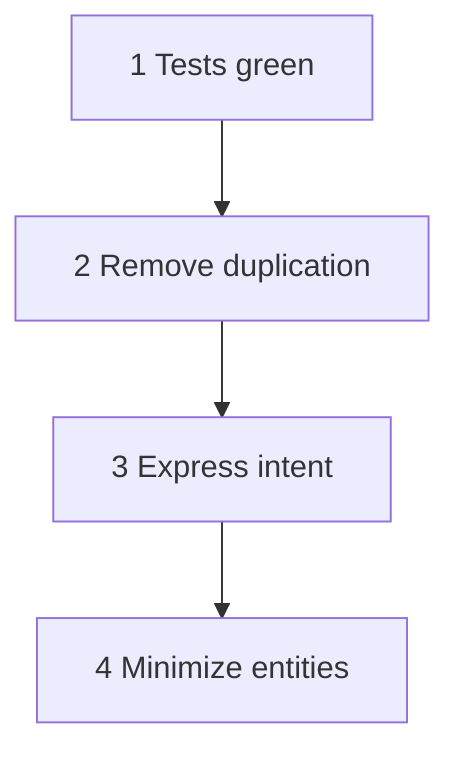
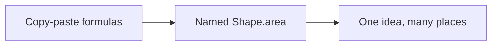

## What this chapter is about

You do not invent a perfect architecture on day one. Simple design *emerges* when you follow a short priority list while refactoring continuously.

## Core ideas

### Kent Beck's four rules of simple design

In priority order:

1. **Runs all the tests** — correctness first; without tests you cannot refactor safely
2. **Contains no duplication** — duplication is often a missing abstraction waiting to be born
3. **Expresses the intent of the programmers** — names and structure should say what you mean
4. **Minimizes the number of classes and methods** — no speculative structure; minimalism comes *last*

### What "emerges" means

Follow the rules under continuous pressure and good shapes appear. Extract duplication when it is real, not when you imagine a future framework. Prefer expressiveness over clever compression.

### Duplication as a design signal

When the same idea is written three ways, the system is trying to tell you there is a concept without a name. Give it one — carefully.

## Visual





## Code Example

*Examples below are in Java.*

Duplication hiding an idea:

```java
double area1 = length * width;
double area2 = radius * radius * Math.PI;
// same formulas later in pricing, reports, UI...
```

Named design idea:

```java
public interface Shape {
  double area();
}

public record Rectangle(double length, double width) implements Shape {
  public double area() {
    return length * width;
  }
}

public record Circle(double radius) implements Shape {
  public double area() {
    return Math.PI * radius * radius;
  }
}
```

## Takeaways

- Priority order matters: tests first, minimalism last
- Expressiveness beats premature abstraction
- Refactor until the design is obvious in the names
