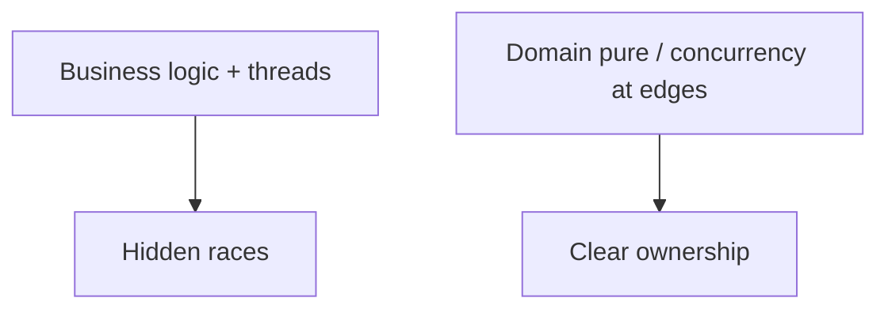

## Overview

Concurrency is a design concern of its own. Mixing thread policy into ordinary business logic hides races and makes failures intermittent, the worst kind to debug.

## Core ideas

### Keep it separate and minimal

Correct single-threaded design first. Then introduce concurrency deliberately, with clear ownership of shared state. Prefer immutability and isolation over synchronized spaghetti.

### Know your shared data

Every mutable value touched by more than one thread needs a story: locked critically and briefly, atomic, confined to one thread, or redesigned away.

### Limit synchronized scope

Wide locks kill throughput and raise deadlock risk. Narrow critical sections; do not hold locks while doing IO or calling untrusted code.

### Understand the execution model

Threads, pools, actors, event loops, each has different failure modes. Use the platform's executors and concurrent collections instead of hand-rolling queues.

### Myths worth dropping

Concurrency does not automatically make things faster. It does not remove the need for design. And "it worked on my machine under light load" is not evidence the shared state is safe.

### Defense in depth

Limit the scope of synchronized data. Use copies when crossing boundaries so callers cannot mutate your internals. Prefer known libraries (executors, concurrent collections) over home-grown locking schemes. Keep concurrent code out of the domain core when you can.

### Test under stress

Races rarely show up in happy-path unit tests. Repeat, load, and shake schedules. Treat "it passed once" as weak evidence.

## Visual




## Code Example

*Examples below are in Java.*

Shared mutable state:

```java
public class Counter {
  private int value;

  public void increment() { // race
    value++;
  }
}
```

Safer approaches:

```java
public final class Counter {
  private final AtomicInteger value = new AtomicInteger();

  public void increment() {
    value.incrementAndGet();
  }

  public int get() {
    return value.get();
  }
}
```

Separate concurrency policy from work:

```java
public final class OrderProcessor {
  public void process(Order order) {
    // pure domain, no threads here
  }
}

ExecutorService pool = Executors.newFixedThreadPool(8);
pool.submit(() -> processor.process(order));
```

## In short

Get the single-threaded design right first. Keep shared mutable state rare and obvious. Stress-test; intermittent passes do not count.
