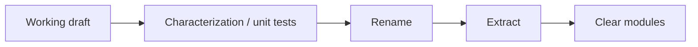

## Core ideas

Clean code is rarely written clean on the first pass. The Args example shows: make it work, then successively refine structure, names, and responsibilities under tests.

- First drafts can be messy; stopping there is the failure
- Refactor in small, test-backed steps
- Aim for modules that each express one clear idea
- Delete paths that confuse more than they help

## Picture



## Code Example

<p class="notes-code-lang"><small>Language: Java</small></p>

### First-cut argument blob

```java
public class Args {
  public Args(String schema, String[] args) {
    // parse schema chars, walk argv, set booleans/ints/strings
    // in one long constructor with many locals and flags
  }

  public boolean getBoolean(char arg) { /* ... */ }
  public int getInt(char arg) { /* ... */ }
}
```

### Refined shape (sketch)

```java
public class Args {
  private final Map<Character, ArgumentMarshaler> marshalers;

  public Args(String schema, String[] args) {
    marshalers = parseSchema(schema);
    parseArgumentStrings(List.of(args));
  }

  public boolean getBoolean(char arg) {
    return BooleanArgumentMarshaler.getValue(marshalers.get(arg));
  }
}

interface ArgumentMarshaler {
  void set(Iterator<String> currentArgument);
}
```

## Takeaways

- Working is necessary; clean is the second delivery
- Tests unlock fearless cleanup
- Refinement is the craft, not a luxury pass
