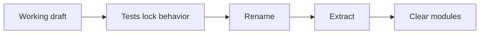

## Overview

Clean code is rarely written clean on the first pass. The Args case study shows the real craft: make it work, then successively refine structure, names, and responsibilities under tests until each module expresses one clear idea.

## Core ideas

### First drafts can be messy

Stopping at "it works" is the failure mode. Working code that resists change is unfinished.

### Refactor in small, test-backed steps

Characterization or unit tests unlock fearless cleanup. Rename, extract, move, one motivation per step, and keep the suite green.

### Aim for modules with one idea

Argument parsing, type marshaling, and error reporting do not belong in one constructor blob. When each concept has a home, readers navigate by name.

### Delete confusing paths

Code that exists "just in case" and confuses more than it helps should go. Git remembers.

## Visual



## Code Example

*Examples below are in Java.*

First-cut argument blob (sketch of the smell):

```java
public class Args {
  public Args(String schema, String[] args) {
    // parse schema chars, walk argv, set booleans/ints/strings
    // in one long constructor with many locals and flags
  }

  public boolean getBoolean(char arg) { /*... */ }
  public int getInt(char arg) { /*... */ }
}
```

Refined shape, marshaling strategy per type:

```java
public class Args {
  private final Map<Character, ArgumentMarshaler> marshalers;

  public Args(String schema, String[] args) {
    marshalers = parseSchema(schema);
    parseArgumentStrings(List.of(args));
  }

  public boolean getBoolean(char arg) {
    return BooleanArgumentMarshaler.getValue(marshalers.get(arg));
  }
}

interface ArgumentMarshaler {
  void set(Iterator<String> currentArgument) throws ArgsException;
}
```

## In short

Working code is the start. With tests in place, rename and extract until each piece has one job.
