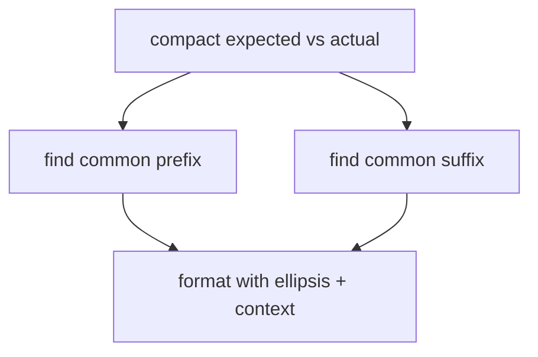

## What this chapter is about

A walk through JUnit's `ComparisonCompactor` shows how small methods, clear names, and incremental cleanup turn index arithmetic into a readable algorithm. Case studies are practice — re-derive the choices, do not only skim them.

## Core ideas

### Study refined real code

Production-hardened helpers teach more than toy samples. Notice how naming turns "what index?" into "common prefix length."

### Extract until steps have names

Compacting a diff is: find shared prefix, find shared suffix, format with ellipsis and context. Each step deserves a function.

### Refactoring encodes understanding

When you finally understand a tangle, leave that understanding in the source so the next reader does not pay the same tuition.

## Visual



## Code Example

*Examples below are in Java.*

Structure of the idea (illustrative):

```java
public class ComparisonCompactor {
  private final int contextLength;
  private final String expected;
  private final String actual;

  public ComparisonCompactor(int contextLength, String expected, String actual) {
    this.contextLength = contextLength;
    this.expected = expected;
    this.actual = actual;
  }

  public String compact(String message) {
    if (expected == null || actual == null || expected.equals(actual)) {
      return Assert.format(message, expected, actual);
    }
    return Assert.format(message, compactString(expected), compactString(actual));
  }

  private String compactString(String source) {
    String result = "[" + extractDiffering(source) + "]";
    if (hasPrefix()) {
      result = startingEllipsis() + result;
    }
    if (hasSuffix()) {
      result = result + endingEllipsis();
    }
    return result;
  }
}
```

## Takeaways

- Algorithms become readable when steps are named
- Case studies stick when you re-implement the design choices
- Small, boring functions beat clever one-liners
