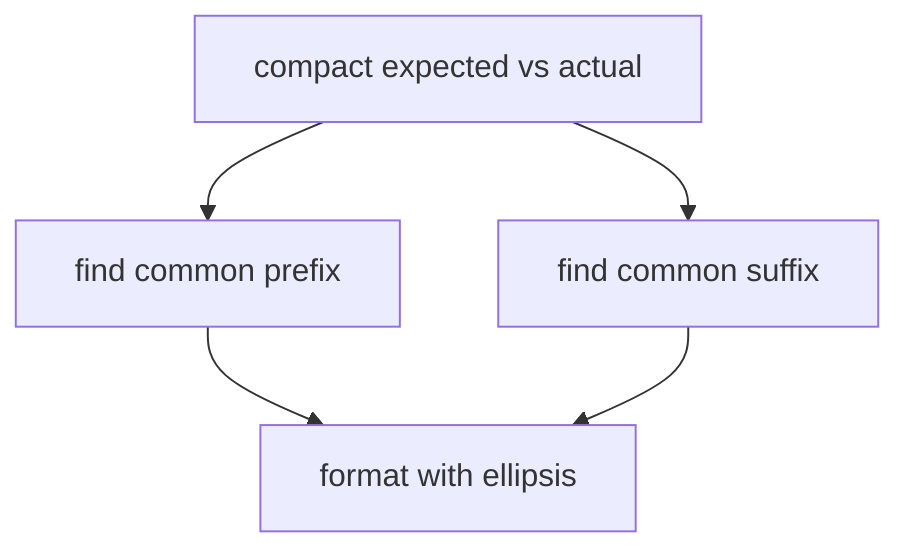

## Core ideas

A walk through JUnit's `ComparisonCompactor`: small methods, clear names, and incremental cleanup make an algorithm teachable.

- Study real code refined under pressure
- Extract until each step of the comparison has a name
- Refactoring encodes understanding into the source

## Picture



## Java

### Idea of the compactor

```java
public class ComparisonCompactor {
  private final int contextLength;
  private final String expected;
  private final String actual;

  public ComparisonCompactor(int contextLength, String expected, String actual) {
    this.contextLength = contextLength;
    this.expected = expected;
    this.actual = actual;
  }

  public String compact(String message) {
    if (expected == null || actual == null || expected.equals(actual)) {
      return Assert.format(message, expected, actual);
    }
    String compactExpected = compactString(expected);
    String compactActual = compactString(actual);
    return Assert.format(message, compactExpected, compactActual);
  }

  private String compactString(String source) {
    String result = "[" + extractDiffering(source) + "]";
    if (prefixLength > 0) {
      result = startingEllipsis() + result;
    }
    if (suffixLength > 0) {
      result = result + endingEllipsis();
    }
    return result;
  }
}
```

(Illustration of structure — naming turns index arithmetic into a readable story.)

## Takeaways

- Algorithms become readable when steps are named
- Case studies are practice: re-derive the choices
- Small, boring functions beat clever one-liners
