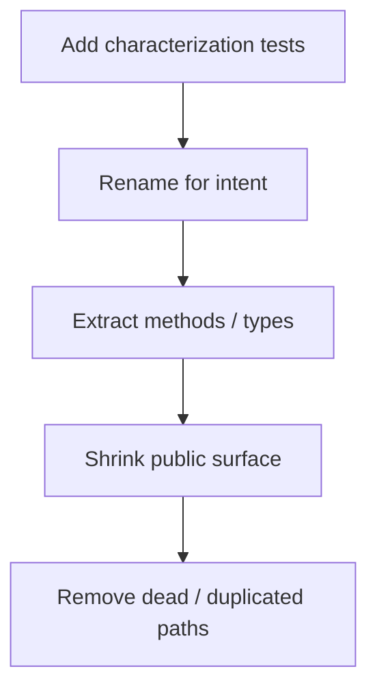

## What this chapter is about

This chapter applies clean-code practices to a real open-source date class. The lesson is the sequence: lock behavior with tests, rename for intent, extract, shrink the public surface, and remove dead or duplicated paths — without changing what the system does.

## Core ideas

### Characterization tests first

Legacy code becomes tractable when tests capture current behavior — including quirks. Only then is cleanup safe.

### Rename and extract before rewriting

Resist the urge to replace the algorithm on day one. Clarify names and boundaries; the better shape often reveals a simpler implementation later.

### Shrink the API

Public surface area is a promise. Move formatting, parsing, and odd utilities to collaborators so the core type stays about dates.

### Use the smells catalog

Chapter 17's heuristics tell you what to fix next: opaque names, feature envy, long methods, speculative flags.

## Visual



## Code Example

*Examples below are in Java.*

Smell: unclear API and mixed concerns:

```java
public abstract class SerialDate {
  public static final int MONDAY = 1;
  public abstract int toSerial();
  public abstract int getYYYY();
  // date math, formatting, relative day utilities...
}
```

Direction of cleanup:

```java
@Test
void mondayConstantMatchesHistoricalValues() {
  // lock legacy meaning before renames
}

public abstract class Date {
  public abstract int toSerialDayNumber();
  public abstract Year year();
}

public final class DateFormat {
  public String format(Date date) { /* ... */ }
}
```

## Takeaways

- Tests first on legacy, then structure
- Preserve behavior while deleting confusion
- Principles stick only when applied to imperfect code
