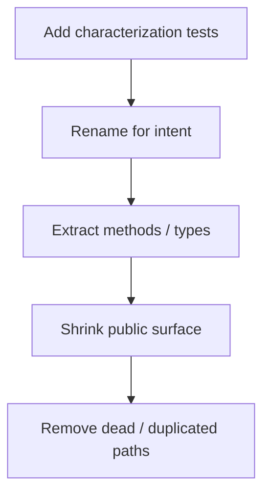

## Core ideas

Apply clean-code practices to a real date class: characterization tests first, then rename, simplify, remove smells, and clarify public vs private intent while preserving behavior.

- Legacy becomes tractable under tests that lock current behavior
- Rename and extract before rewriting algorithms
- Delete dead paths; expose a minimal API
- Heuristics from chapter 17 guide what to fix next

## Picture



## Code Example

<p class="notes-code-lang"><small>Language: Java</small></p>

### Smell: unclear API and mixed concerns

```java
public abstract class SerialDate {
  public static final int MONDAY = 1; // magic calendars...
  public abstract int toSerial();
  public abstract int getYYYY();
  // dozens of date utilities, relative day math, formatting...
}
```

### Direction of cleanup

```java
// 1) Lock behavior
@Test
void mondayConstantMatchesHistoricalValues() { /* ... */ }

// 2) Rename toward domain language
public abstract class Date {
  public abstract int toSerialDayNumber();
  public abstract Year year();
}

// 3) Move formatting / parsing to collaborators
public final class DateFormat {
  public String format(Date date) { /* ... */ }
}
```

## Takeaways

- Tests first on legacy, then structure
- Preserve behavior while deleting confusion
- Principles stick only when applied to imperfect code
