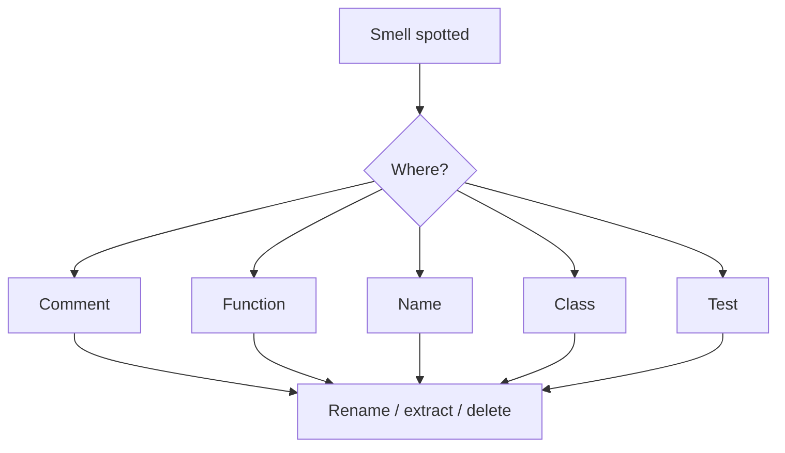

## Core ideas

A checklist of smells spanning comments, environment, functions, names, classes, and tests. Signals, not laws — prefer the smallest change that removes the smell.

Recurring themes: duplication, opacity, feature envy, long parameter lists, speculative generality, poor encapsulation, unassertive tests.

## Picture



## Code Example

<p class="notes-code-lang"><small>Language: Java</small></p>

### Opaque function name

```java
Date newDate = date.add(5); // days? months? mutate?
```

```java
Date newDate = date.plusDays(5); // clear, non-mutating
date.addDays(5);                 // clear if it mutates — pick one style
```

### Feature envy / Demeter

```java
double amount = order.getCustomer().getWallet().getBalance();
```

```java
double amount = order.customerBalance();
```

### Flag argument

```java
render(page, true);
render(page, /* includeHeader */ true);
```

```java
renderWithHeader(page);
renderBodyOnly(page);
```

## Checklist (abbrev.)

- Comments: obsolete, redundant, commented-out code
- General: duplication, clutter, too much interface, multiple languages in one file
- Functions: too many args, flags, output args, dead functions
- Names: encoded, disinformative, wrong abstraction level
- Classes: too big, too many fields, god classes
- Tests: unclear, incomplete, unassertive

## Takeaways

- A name smell often hides a deeper design smell
- Structure beats convention when you can enforce it
- Make the next reader faster
