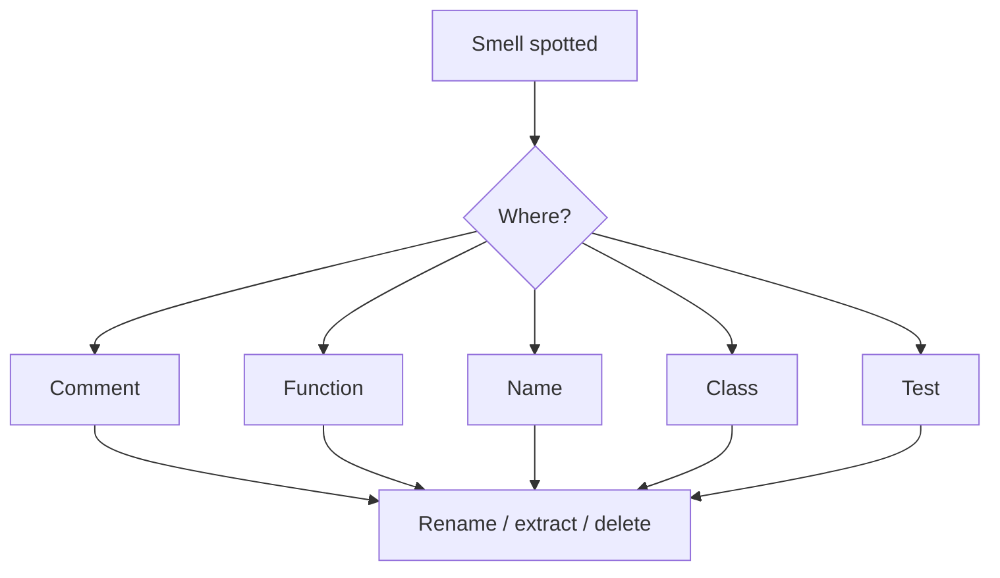

## What this chapter is about

A practical catalog of smells spanning comments, environment, functions, names, classes, and tests. Treat them as **signals**, not laws. Prefer the smallest change that removes the smell. A name smell often hides a deeper design smell.

## Core ideas

### Comments

Inappropriate information, obsolete notes, redundant restatements, poorly written comments, commented-out code.

### Environment / general

Builds or tests that need more than one step; **duplication** (the book's strongest general rule); multiple languages jammed into one file; fat interfaces; clutter; vertical/horizontal opacity; feature envy; dead code; speculative generality; convention without structure to enforce it.

Prefer polymorphism to sprawling `if`/`switch` when types vary. Do not inherit constants to cheat scoping. Revisit names as meaning drifts. Function names must say what they do.

### Functions

Too many arguments; output arguments; **flag arguments** (avoid them — do not add them); dead functions; boolean entanglement; temporal coupling without names that reveal order.

### Names, classes, tests

Encoded or disinformative names; names at the wrong abstraction level; classes that are too big or hold too many fields; tests that are unclear, incomplete, or unassertive.

## Visual



## Code Example

*Examples below are in Java.*

Opaque name:

```java
Date newDate = date.add(5); // days? months? mutate?
Date newDate = date.plusDays(5);
```

Feature envy / Demeter:

```java
double amount = order.getCustomer().getWallet().getBalance();
double amount = order.customerBalance();
```

Flag argument:

```java
render(page, true);
renderWithHeader(page);
renderBodyOnly(page);
```

## Checklist (abbrev.)

- Comments: obsolete, redundant, commented-out
- General: duplication, clutter, oversized interfaces
- Functions: arity, flags, output args, dead code
- Names: encoded, wrong level
- Classes: too big, too many fields
- Tests: unclear or unassertive

## Takeaways

- Smells are prompts to improve design, not scorecards
- Structure beats convention when you can enforce it
- Make the next reader faster
