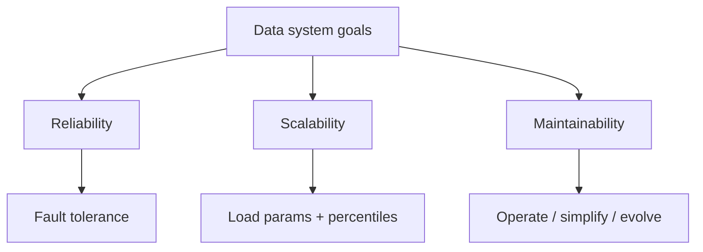
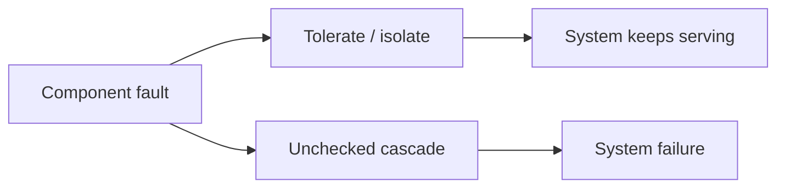

## What this chapter is about

Modern systems are constrained more by **data** than by CPU. The craft is choosing tools and designs that keep data correct, stay fast enough under load, and remain operable by humans — despite faults.

## Core ideas

### Reliability

The system should continue to work correctly even when things go wrong.

A **fault** is one component misbehaving; a **failure** is the whole system stopping. You cannot prevent all faults, so design so faults do not become failures.

- Hardware: redundancy used to be enough; at scale you also need software that survives losing machines
- Software: bugs often come from assumptions that were true until they weren't — self-checks and careful degradation help
- Humans: most outages involve people — sandbox environments, fast rollbacks, good defaults, monitoring, and minimal sharp edges reduce blast radius

### Scalability

As load grows, there should be a reasonable way to cope.

First define **load parameters** (QPS, read/write ratio, payload size, working set). Batch systems care about throughput; online systems care about response time. Report **percentiles** (p95/p99), measured client-side on realistic traffic — averages hide the tail, and the slowest users often have the most data.

Elastic autoscaling helps unpredictable load; manual scaling is simpler and can surprise less. Early products should optimize for iteration speed over hypothetical mega-scale.

### Maintainability

Most software cost is ongoing maintenance. Aim for:

- **Operable** — monitoring, docs, good defaults, self-healing with manual override
- **Simple** — reduce accidental complexity with abstractions (not by deleting features)
- **Evolvable** — change without fear; agile practices support this when the codebase allows it

## Visual





## Code Example

*Snippets below use Java, SQL, or plain text as labeled.*

Percentiles beat averages:

```text
1000 requests sorted by duration
p50 = index 500   # typical
p99 = index 990   # painful tail
avg = mean(all)   # hides the tail
```

Operability hooks:

```java
public Money charge(UserId user, Money amount) {
  Timer.Sample sample = Timer.start(meterRegistry);
  try {
    Money result = billing.charge(user, amount);
    meterRegistry.counter("billing.charge.ok").increment();
    return result;
  } catch (Exception e) {
    meterRegistry.counter("billing.charge.fail").increment();
    throw e;
  } finally {
    sample.stop(Timer.builder("billing.charge").register(meterRegistry));
  }
}
```

## Takeaways

- Fault ≠ failure; design so faults do not cascade
- Measure the latency tail on the client
- Operability and evolvability dominate lifetime cost
