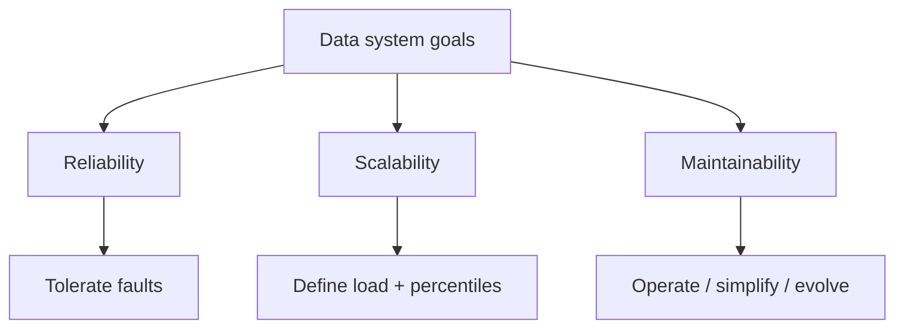

## Core ideas

Data size, not CPU, is usually the constraint. Our job is to pick tools that keep data correct, perform well, and survive faults.

- **Reliability** — keep working correctly despite faults. A *fault* is one component misbehaving; a *failure* is the whole system stopping. Design for fault tolerance (hardware redundancy + software that survives machine loss).
- **Scalability** — define load parameters first (QPS, read/write ratio, payload size). Batch cares about throughput; online cares about latency. Report **percentiles** (p95/p99), measured client-side on realistic traffic.
- **Maintainability** — most cost is ongoing work. Aim for operable (monitoring, defaults, rollbacks), simple (good abstractions), and evolvable (change without fear).

Early startups should optimize for iteration speed over hypothetical mega-scale.

## Picture



## Example

### Latency as percentiles (not averages)

```text
1000 requests sorted by duration
p50  = duration at index 500   # typical user
p99  = duration at index 990   # the painful tail
avg  = mean(all)               # hides the tail
```

### Operability hooks in application code

```java
public Money charge(UserId user, Money amount) {
  Timer.Sample sample = Timer.start(meterRegistry);
  try {
    Money result = billing.charge(user, amount);
    meterRegistry.counter("billing.charge.ok").increment();
    return result;
  } catch (Exception e) {
    meterRegistry.counter("billing.charge.fail").increment();
    throw e;
  } finally {
    sample.stop(Timer.builder("billing.charge").register(meterRegistry));
  }
}
```

## Takeaways

- Fault ≠ failure; prevent faults from cascading
- Measure the tail; the slowest users often have the most data
- Make routine ops easy — that is where lifetime cost lives
