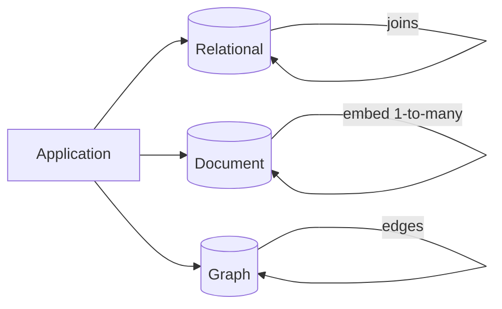

## Core ideas

Data models shape how we think about the problem.

- **Relational** — hides storage behind a clean interface; strong joins; schema-on-write
- **Document** — locality for tree-shaped data; flexible schema-on-read; weaker many-to-one/many-to-many
- **Graph** — best when many-to-many relationships dominate (Cypher, etc.)
- **Polyglot persistence** — use multiple stores; hybrids are increasingly common

Declarative query languages (SQL) describe *what*, not *how*, and parallelize more easily than imperative MapReduce-style code.

Prefer IDs for reference data humans might rename. Documents must stay reasonably small to keep locality benefits.

## Picture



## Example

### Same domain, two models

```sql
-- Relational: normalize many-side
CREATE TABLE users (id BIGINT PRIMARY KEY, name TEXT);
CREATE TABLE positions (
  id BIGINT PRIMARY KEY,
  user_id BIGINT REFERENCES users(id),
  title TEXT
);
SELECT u.name, p.title
FROM users u JOIN positions p ON p.user_id = u.id;
```

```json
// Document: embed one-to-many for locality
{
  "id": 1,
  "name": "Ada",
  "positions": [
    { "title": "Engineer" },
    { "title": "Manager" }
  ]
}
```

### Declarative vs imperative flavor

```sql
-- Declarative: optimizer chooses plan
SELECT region, COUNT(*) FROM orders GROUP BY region;
```

```java
// Imperative MapReduce-style sketch
Map<String, Long> counts = new HashMap<>();
for (Order o : orders) {
  counts.merge(o.region(), 1L, Long::sum);
}
```

## Takeaways

- Match model to relationship shape and access pattern
- Document ≠ schemaless — schema moves to read time
- Joins vs locality is the recurring trade-off
