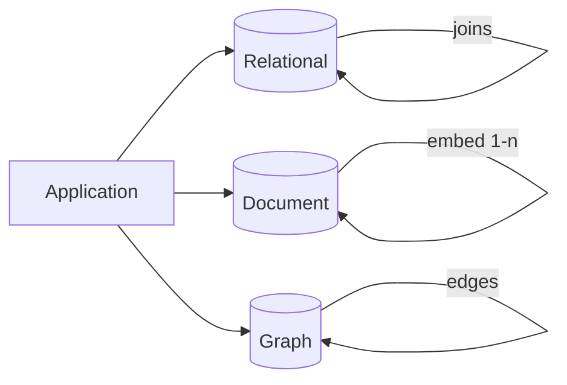
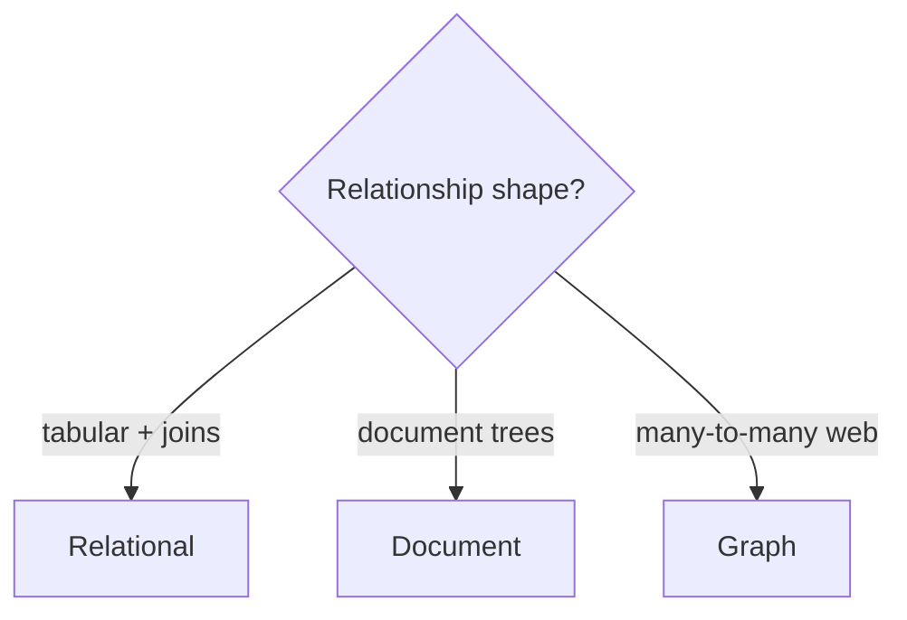

## What this chapter is about

Data models shape how we think about problems. Relational, document, and graph models optimize different relationship shapes and access patterns — and most serious systems end up **polyglot**.

## Core ideas

### Relational model

Still the default for good reasons: a clean interface over storage, a powerful query optimizer, and excellent joins. Schema-on-write catches many mistakes early. The object/relational mismatch is real; ORMs reduce friction but do not erase it.

One-to-many options: normalized child tables, multi-valued columns, or opaque JSON blobs (usually worst for querying).

### Document model

Documents embed tree-shaped data with locality — great when you usually load a whole aggregate. Schema-on-read is flexible but still a schema (just enforced later). Many-to-one / many-to-many are awkward; applications often simulate joins. Documents must stay reasonably small or locality dies.

### Graph model

When many-to-many relationships dominate, graphs (and declarative languages like Cypher) fit better than forcing everything into tables or documents.

### Query languages

Declarative SQL describes *what* you want; the engine chooses *how*, which aids optimization and parallelism. MapReduce-style imperative jobs are more explicit but harder to compose. Prefer IDs for reference data humans might rename.

Relational and document stores are converging (JSON in SQL; joins in document DBs). Hybrids are normal.

## Visual





## Code Example

*Snippets below use Java, SQL, or plain text as labeled.*

Same domain, two models:

```sql
CREATE TABLE users (id BIGINT PRIMARY KEY, name TEXT);
CREATE TABLE positions (
  id BIGINT PRIMARY KEY,
  user_id BIGINT REFERENCES users(id),
  title TEXT
);
SELECT u.name, p.title
FROM users u JOIN positions p ON p.user_id = u.id;
```

```json
{
  "id": 1,
  "name": "Ada",
  "positions": [
    { "title": "Engineer" },
    { "title": "Manager" }
  ]
}
```

Declarative aggregation vs hand-rolled:

```sql
SELECT region, COUNT(*) FROM orders GROUP BY region;
```

```java
Map<String, Long> counts = new HashMap<>();
for (Order o : orders) {
  counts.merge(o.region(), 1L, Long::sum);
}
```

## Takeaways

- Match model to relationship shape and access pattern
- Document ≠ schemaless — the schema moves to read time
- Joins vs locality is the recurring trade-off
