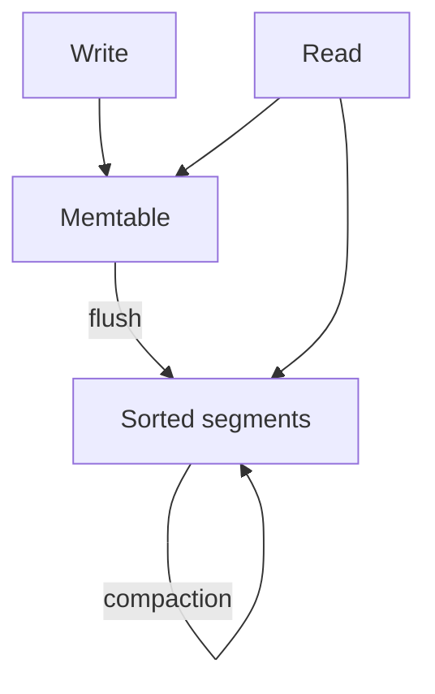
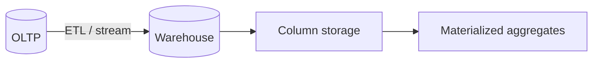

## Core ideas

The simplest efficient write is **append to a file**. Indexes are chosen deliberately — they speed reads and cost writes.

- **Hash index** — in-memory key → offset; great point lookups; no range queries; table must fit memory
- **LSM-tree** — memtable + sorted segments + compaction; fast writes; bloom filters help negative lookups
- **B-tree** — fixed-size pages, O(log n), standard for OLTP RDBMS; WAL + latches for crash/concurrency

Secondary, clustered, multi-column, and fuzzy indexes extend access patterns. In-memory DBs win latency but need async durability.

**OLTP** vs **OLAP**: separate warehouses (ETL/ELT) so analytics do not crush transactions. Warehouses often use **column storage** + compression + materialized aggregates.

## Picture





## Example

### Append-only log + hash index (sketch)

```java
public final class HashKvStore {
  private final Map<String, Long> index = new HashMap<>();
  private final RandomAccessFile log;

  public void put(String key, byte[] value) throws IOException {
    long offset = log.length();
    log.seek(offset);
    log.writeUTF(key);
    log.writeInt(value.length);
    log.write(value);
    index.put(key, offset);
  }

  public byte[] get(String key) throws IOException {
    Long offset = index.get(key);
    if (offset == null) return null;
    log.seek(offset);
    log.readUTF();
    int len = log.readInt();
    byte[] value = new byte[len];
    log.readFully(value);
    return value;
  }
}
```

### Column vs row mental model

```text
Row store:   [user=1,age=30,city=Berlin] [user=2,age=41,city=Lisbon]
Column store age: [30, 41, ...]   # scan only what the query needs
```

## Takeaways

- Indexes are a read/write trade — create them on purpose
- LSM: write-friendly; B-tree: predictable reads / OLTP default
- Split OLTP and analytics when access patterns diverge
