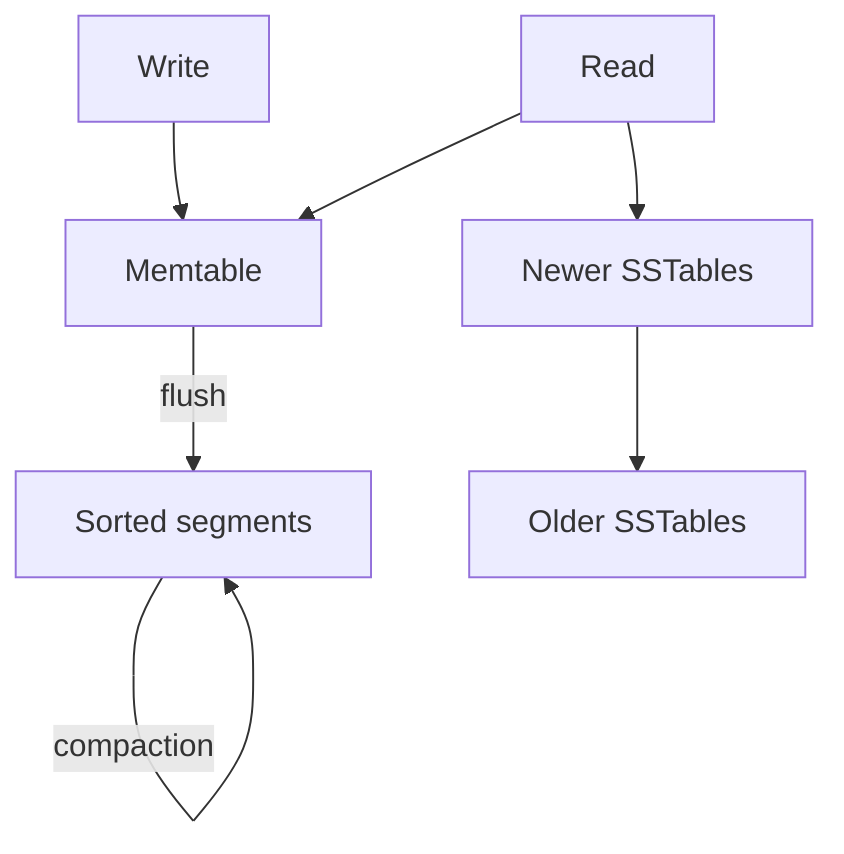
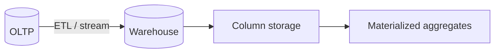

## What this chapter is about

Under every database is a bet about how to lay bytes on disk (or in memory) so writes and reads stay feasible. The simplest efficient write is **append to a file**; indexes are deliberate trade-offs that speed reads and cost writes.

## Core ideas

### Log-structured storage

**Hash indexes** map keys to byte offsets in an append-only log. Fast point lookups; table must fit memory; no efficient range scans. Segments compact in the background.

**LSM-trees** keep a sorted memtable, flush to sorted segments, and compact. Excellent write throughput and compression; reads may check several levels (bloom filters help negatives). Compaction can steal disk bandwidth.

### Page-oriented storage

**B-trees** split data into fixed-size pages (often ~4KB), stay balanced at O(log n), and dominate OLTP relational engines. WAL + latches provide crash safety and concurrency. Optimizations include copy-on-write pages, key abbreviations, and sibling pointers.

Roughly: LSM favors write-heavy workloads; B-trees favor predictable reads and update-in-place patterns. Both support secondary indexes.

### Other index flavors

Clustered indexes store row data in the index. Multi-column / specialized indexes help geo and similar queries. Fuzzy indexes support similarity search. In-memory databases win latency but need a durability story.

### OLTP vs analytics

Operational databases (OLTP) optimize point lookups and small transactions. Warehouses (OLAP) optimize scans of few columns over many rows — hence **column storage**, compression, vectorized execution, and materialized aggregates. ETL/ELT keeps analytics from crushing production.

## Visual





## Code Example

*Snippets below use Java, SQL, or plain text as labeled.*

Append-only log + hash index (sketch):

```java
public final class HashKvStore {
  private final Map<String, Long> index = new HashMap<>();
  private final RandomAccessFile log;

  public void put(String key, byte[] value) throws IOException {
    long offset = log.length();
    log.seek(offset);
    log.writeUTF(key);
    log.writeInt(value.length);
    log.write(value);
    index.put(key, offset);
  }

  public byte[] get(String key) throws IOException {
    Long offset = index.get(key);
    if (offset == null) return null;
    log.seek(offset);
    log.readUTF();
    int len = log.readInt();
    byte[] value = new byte[len];
    log.readFully(value);
    return value;
  }
}
```

Column vs row mental model:

```text
Row:    [user=1,age=30,city=Berlin] [user=2,age=41,city=Lisbon]
Column: age -> [30, 41, ...]   # scan only what the query needs
```

## Takeaways

- Indexes are a read/write trade — create them on purpose
- LSM: write-friendly; B-tree: predictable OLTP default
- Split OLTP and analytics when access patterns diverge
