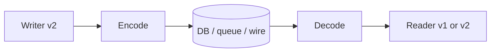
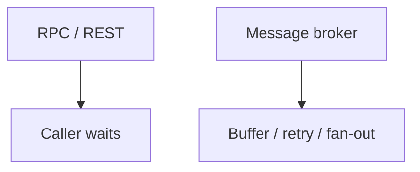

## What this chapter is about

Features change stored data. In production, old and new code — and old and new data formats — coexist. **Backward** and **forward** compatibility are how rolling upgrades stay possible.

## Core ideas

### Encoding formats

Moving data between memory and the network requires encode/decode. Language-native pickles are convenient and dangerous (security, portability, performance). Prefer JSON/XML for humans; Avro/Protobuf/Thrift when you want compact binary plus an explicit schema and codegen.

### Modes of dataflow

1. **Through a database** — a process sends a message to its future self; needs both backward and forward compatibility
2. **Service calls (REST / RPC)** — expose deliberate APIs; expect mixed client/server versions
3. **Async messaging** — brokers buffer, retry, fan-out, and decouple; replies need another channel

### Why RPC is not a local call

Network calls time out, fail partially, retry into duplicates, and have wild latency. Design for at-least-once delivery plus **idempotence**. REST dominates public APIs; RPC remains common inside a datacenter. Maintain multiple API versions when you cannot force clients to upgrade.

## Visual





## Code Example

*Snippets below use Java, SQL, or plain text as labeled.*

Evolving a schema (Protobuf-style field rules):

```protobuf
message User {
  int64 id = 1;
  string email = 2;
  // Added later: old readers ignore unknown fields.
  string display_name = 3;
}
```

Idempotent charge:

```java
// Dangerous without an idempotency key
paymentClient.charge(orderId, amount);

// Safer
paymentClient.charge(IdempotencyKey.of(orderId), orderId, amount);
```

Fan-out via a topic:

```text
OrderService --publish OrderPlaced--> broker
                                      |- Inventory
                                      |- Email
                                      |- Analytics
```

## Takeaways

- Plan for mixed versions in production
- Network ≠ function call; design for retries + idempotence
- Brokers trade sync replies for resilience
