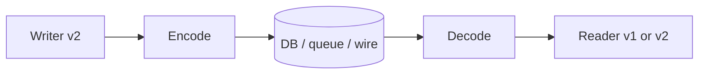

## Core ideas

Features change stored data. **Backward** and **forward** compatibility let old and new code/data coexist.

- Prefer JSON/XML/Avro/Protobuf/Thrift over language-native pickle formats (security, portability, performance)
- Binary + schema (Protobuf, Thrift, Avro) is compact and documents the contract
- Dataflow paths: **database**, **services** (REST/RPC), **async messaging**

RPC looks like a local call but is not: timeouts, retries, duplicates, variable latency. Prefer idempotence. REST dominates public APIs; RPC is common inside a datacenter.

Message brokers buffer, retry, fan-out, and decouple — but replies need another channel.

## Picture



## Code Example

<p class="notes-code-lang"><small>Snippets in Java, SQL, or pseudocode as labeled.</small></p>

### Evolving a schema (Protobuf-style field rules)

```protobuf
message User {
  int64 id = 1;
  string email = 2;
  // Added later: old readers ignore unknown fields (forward compat
  // if writers keep writing fields old readers need).
  string display_name = 3;
}
```

### Why naive RPC retries hurt

```java
// Dangerous without idempotency keys
paymentClient.charge(orderId, amount);

// Safer
paymentClient.charge(IdempotencyKey.of(orderId), orderId, amount);
```

### Async decoupling

```text
OrderService --publish OrderPlaced--> broker topic
                                      |- Inventory
                                      |- Email
                                      |- Analytics
```

## Takeaways

- Plan for mixed versions in production
- Network ≠ function call; design for at-least-once + idempotence
- Brokers trade sync replies for resilience and fan-out
