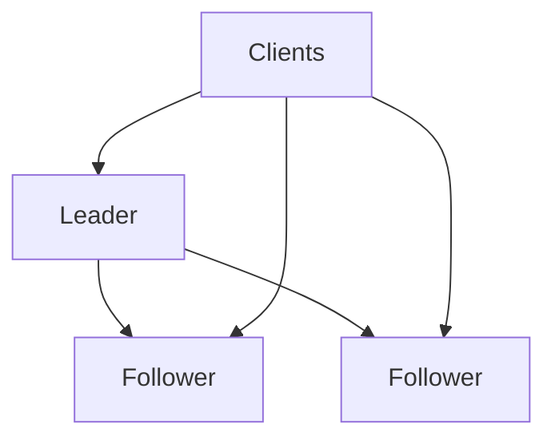
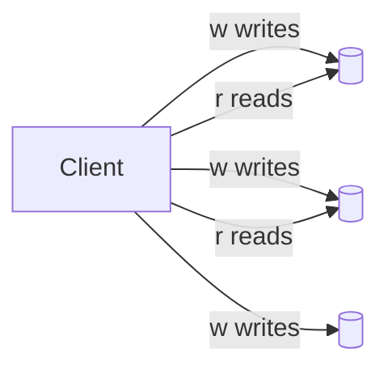

## What this chapter is about

Replication copies data for latency, availability, and read scale. The hard part is **ongoing change** — sync vs async, failover, lag, and conflicts.

## Core ideas

### Single-leader replication

Writes go to a leader; followers apply the change stream; clients may read any replica. Common and well understood. Fully synchronous replicas stall writes when a follower hangs, so production often syncs one (or a few) and leaves others async.

Failover elects a new leader — risks include unreplicated writes and **split brain**. Replication formats: statement-based (fragile), WAL (coupled to storage), logical logs (better decoupling), triggers (flexible, heavier).

### Replication lag

Under async replication, readers can see the past. Application-level cures:

- **Read-your-writes** — read self-writes from the leader (or until a timestamp catches up)
- **Monotonic reads** — sticky replica so time does not go backwards for a user
- **Consistent prefix** — causally related writes stay ordered

If multi-minute lag is unacceptable, you need stronger guarantees than pure eventual consistency.

### Multi-leader

A leader per datacenter improves locality and independence, but concurrent writes conflict. Avoid conflicts when possible; otherwise last-write-wins, replica priority, merge, or explicit conflict records. Topologies (circular/star/all-to-all) each have failure and causality pitfalls. Often considered dangerous for good reason.

### Leaderless (Dynamo-style)

Clients write/read several replicas; quorums `w + r > n` detect freshness. Repair via read repair and anti-entropy. Concurrent writes need merge / version vectors; last-write-wins converges by discarding data.

## Visual





## Code Example

*Snippets below use Java, SQL, or plain text as labeled.*

Quorum intuition:

```text
n = 3
w = 2, r = 2  => w + r > n  (overlap sees a fresh write)
w = 1, r = 1  => faster, staler
```

Read-your-writes routing:

```java
public Profile readProfile(UserId id, Optional<Instant> lastWrite) {
  if (lastWrite.isPresent()
      && clock.instant().isBefore(lastWrite.get().plusSeconds(5))) {
    return leader.read(id);
  }
  return replica.read(id);
}
```

Statement-based pitfall:

```sql
UPDATE accounts SET last_active = NOW() WHERE id = 42;
-- Prefer replicating the concrete value the leader used
UPDATE accounts SET last_active = '2026-09-30T12:00:00Z' WHERE id = 42;
```

## Takeaways

- Async replication is common; name the consistency you need
- Automated failover is powerful and dangerous
- Quorums and version vectors are the Dynamo toolkit
