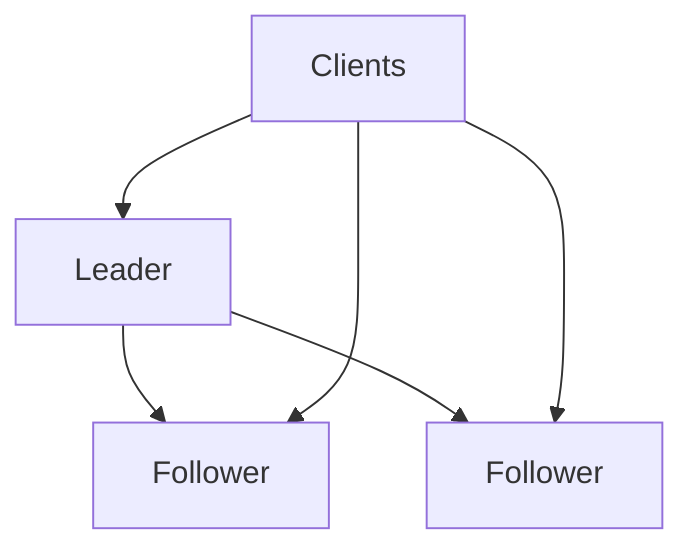
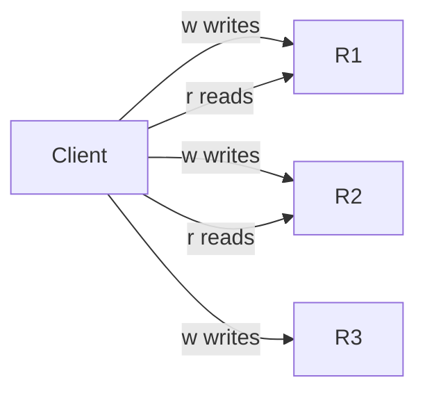

## Core ideas

Replication copies data for latency, availability, and scale. Hard part: **ongoing change**.

- **Single-leader** — writes to leader, followers replicate (sync/async mix is common)
- **Multi-leader** — a leader per datacenter; better locality; conflict-prone
- **Leaderless (Dynamo)** — clients write/read several replicas; quorums `w + r > n`

Replication lag needs application-visible guarantees: **read-your-writes**, **monotonic reads**, **consistent prefix**. Failover risks split brain and lost unreplicated writes.

Conflict tools: last-write-wins (loses data), merge, happens-before, **version vectors**.

## Picture





## Example

### Quorum intuition

```text
n = 3 replicas
w = 2, r = 2  => w + r > n  (overlap guarantees seeing a fresh write)
w = 1, r = 1  => faster, more stale reads
```

### Read-your-writes routing (sketch)

```java
public Profile readProfile(UserId id, Optional<Instant> lastWrite) {
  if (lastWrite.isPresent() && clock.instant().isBefore(lastWrite.get().plusSeconds(5))) {
    return leader.read(id); // recent self-write: avoid stale follower
  }
  return replica.read(id);
}
```

### Statement-based replication pitfall

```sql
-- On leader this uses NOW(); replaying the statement on followers drifts
UPDATE accounts SET last_active = NOW() WHERE id = 42;

-- Replicate the concrete value instead (row-based / logical)
UPDATE accounts SET last_active = '2026-09-30T12:00:00Z' WHERE id = 42;
```

## Takeaways

- Async replication is common; name the consistency you actually need
- Automated failover is powerful and dangerous (split brain)
- Quorums and version vectors are the Dynamo toolkit
