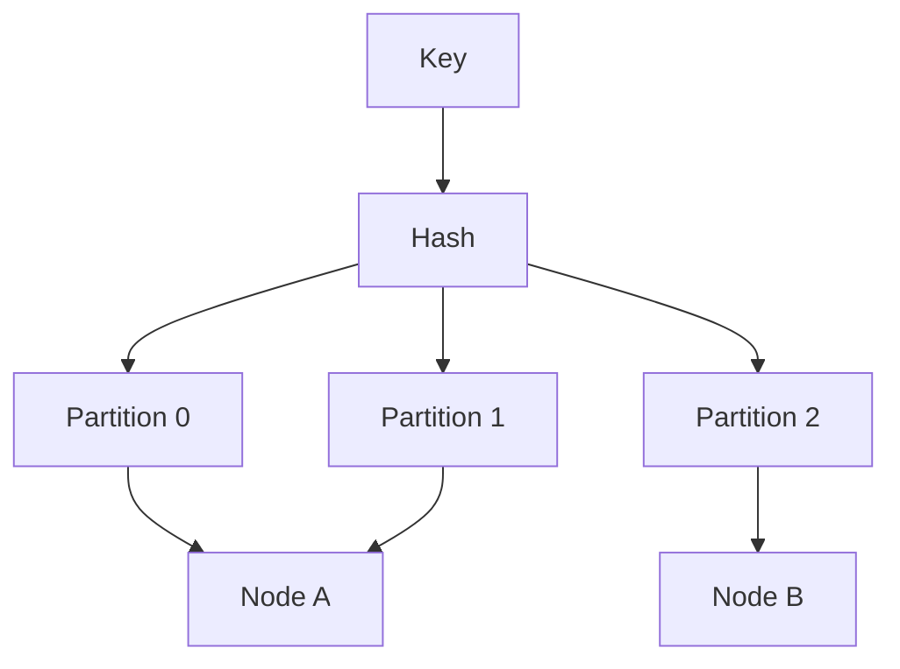

## Core ideas

Partitioning (sharding) spreads data/load when one node is not enough. Usually combine with replication. Goal: even load, avoid **hot spots**.

- **Key-range** — good for range scans; hot keys (time, celebrity) still hurt
- **Hash** — spreads load; loses efficient range queries (compound keys can help)
- Secondary indexes: **local** (scatter-gather reads) vs **global** (faster reads, harder writes)

Rebalancing: avoid `hash % N` (moves almost everything). Prefer many fixed partitions, dynamic splits, or partitions-per-node — keep a human in the loop. Routing via nodes, proxy, or clients; often coordinated with ZooKeeper-like metadata.

## Picture



## Example

### Bad vs better placement

```java
int badPartition(String key, int n) {
  return Math.floorMod(key.hashCode(), n); // almost all keys move when n changes
}

int fixedPartition(String key, int partitionCount) {
  return Math.floorMod(stableHash(key), partitionCount); // move whole partitions between nodes
}
```

### Hot key scatter

```text
celebrityId                -> one hot partition
celebrityId + random(0..9) -> 10 shards (app must fan-in on read)
```

### Local secondary index query

```sql
-- Must ask every partition: WHERE email = ?
-- Global term index would map email -> {partition, pk} instead
```

## Takeaways

- Partition for balance; design explicitly for skewed keys
- Index strategy decides whether reads or writes pay
- Rebalance with partition moves, not remapping every key
