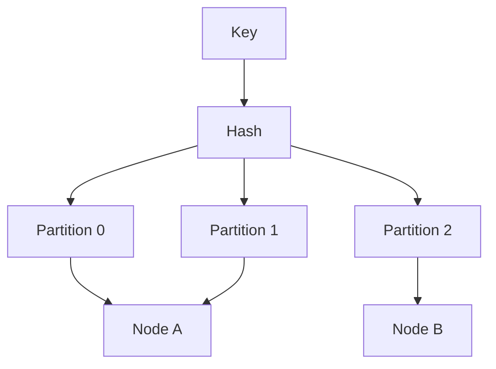
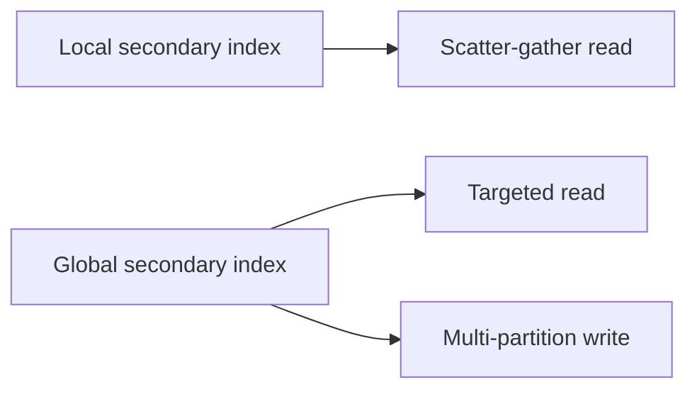

## What this chapter is about

When data or load exceeds one node, **partitioning (sharding)** spreads it. Typically combined with replication. The goal is even load — and avoiding **hot spots**.

## Core ideas

### Partitioning key-value data

- **Key-range** — sorted keys with boundaries; great for range scans; hot keys (time prefixes, celebrities) still hurt; boundaries need care
- **Hash** — spreads load; loses efficient range queries (compound keys can restore some patterns)

Skewed popular keys may need application-level scatter (random suffixes) with fan-in on read.

### Secondary indexes

**Local (document-partitioned) indexes** live inside each partition — writes are local; reads may scatter-gather. **Global (term-partitioned) indexes** make reads targeted but writes touch multiple partitions (often async).

### Rebalancing

Avoid `hash % N` — almost every key moves when N changes. Better patterns: many fixed partitions moved between nodes; dynamic split/merge by size; partitions proportional to nodes. Keep a human in the loop — fully automatic rebalance can surprise you.

### Request routing

Something must map keys → partitions → nodes: the nodes themselves, a proxy tier, or smart clients. Coordination services (ZooKeeper et al.) often hold the cluster metadata.

## Visual





## Code Example

*Snippets below use Java, SQL, or plain text as labeled.*

Bad vs better placement:

```java
int badPartition(String key, int n) {
  return Math.floorMod(key.hashCode(), n); // remaps almost everything when n changes
}

int fixedPartition(String key, int partitionCount) {
  return Math.floorMod(stableHash(key), partitionCount); // move whole partitions
}
```

Hot-key scatter:

```text
celebrityId                -> one hot partition
celebrityId + random(0..9) -> 10 shards (fan-in on read)
```

## Takeaways

- Partition for balance; design explicitly for skewed keys
- Index strategy decides whether reads or writes pay
- Rebalance by moving partitions, not remapping every key
