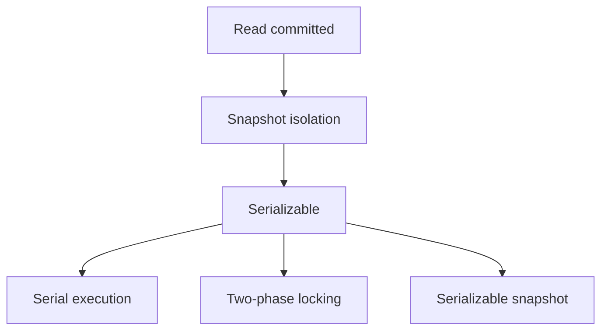

## Core ideas

A transaction groups reads/writes into one all-or-nothing unit.

**ACID (practical reading):**
- Atomicity — abort + retry on fault mid-writes
- Consistency — mostly an *application* invariant
- Isolation — concurrent txs do not step on each other (levels vary)
- Durability — committed data survives crashes (and replicas)

Single-object atomicity is common; multi-object is harder across partitions.

Weak levels: **read committed** (no dirty read/write), **snapshot** (no read skew). Still watch **lost updates**, **write skew**, **phantoms**.

**Serializability** via single-thread execution, **2PL**, or **SSI** (optimistic; often the modern default direction).

## Picture



## Example

### Lost update

```sql
-- Two txs both read balance=100 and write 120  => one increment lost
UPDATE accounts SET balance = 120 WHERE id = 1;

-- Prefer atomic update
UPDATE accounts SET balance = balance + 20 WHERE id = 1;

-- Or lock the row
SELECT balance FROM accounts WHERE id = 1 FOR UPDATE;
```

### Write skew sketch

```text
Two doctors on call. Each txn sees "other is on call" and both go off duty.
Locks / serializable isolation required — row locks on different rows are not enough.
```

### Compare-and-set

```sql
UPDATE documents
SET content = $new, version = version + 1
WHERE id = $id AND version = $seen_version;
```

## Takeaways

- "ACID" databases often ship weak isolation by default — know what you have
- Lost updates and write skew survive read-committed
- Prefer serializable when correctness is hard to audit by inspection
