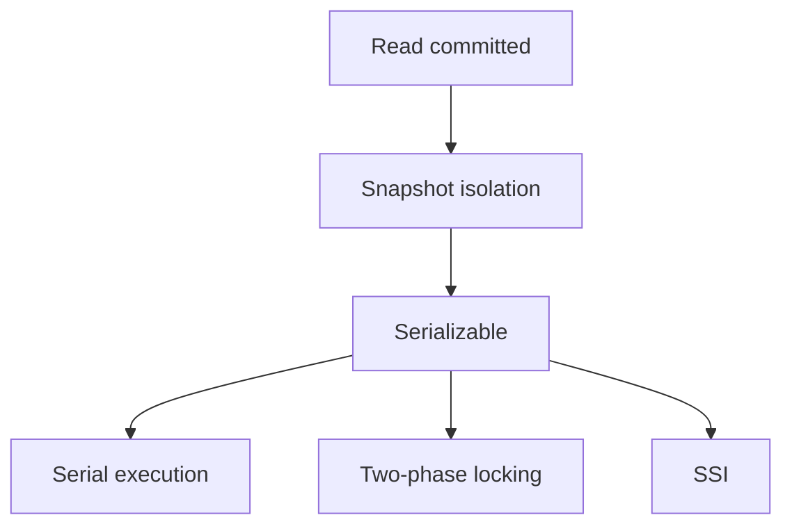
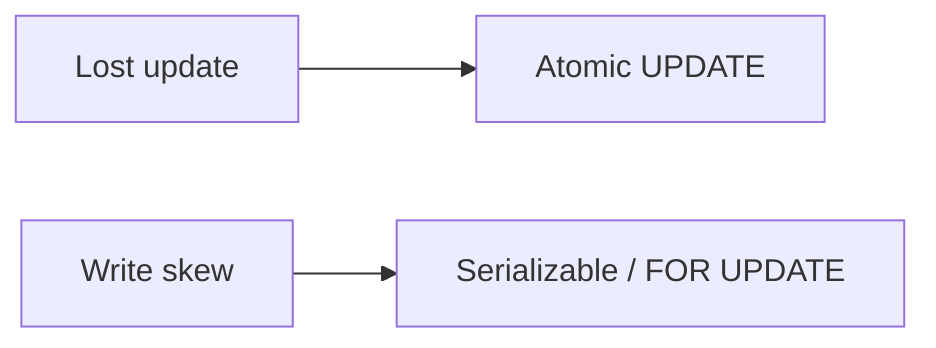

## What this chapter is about

A transaction groups reads and writes into one logical unit that succeeds or fails together. "ACID" is slippery in marketing — know what isolation you actually have.

## Core ideas

### ACID, practically

- **Atomicity** — mid-flight faults abort the whole unit; safe to retry (with care)
- **Consistency** — mostly application invariants the database helps enforce
- **Isolation** — concurrent transactions should not step on each other (levels vary widely)
- **Durability** — committed data survives crashes (and enough replicas)

Single-object atomicity is common; multi-object transactions across partitions are hard, so many distributed stores weaken or drop them.

### Weak isolation you will actually meet

**Read committed** prevents dirty reads/writes — not read skew. **Snapshot isolation** gives each transaction a consistent freeze of the database — still allows lost updates, write skew, and phantoms unless you add more.

Lost-update defenses: atomic `UPDATE ... SET x = x + 1`, `SELECT FOR UPDATE`, automatic lost-update detection, compare-and-set, or app-level merge on replicas.

Write skew and phantoms often need serializable isolation or carefully designed locks / materialized conflicts.

### Serializability

Strongest isolation: transactions behave as if run one at a time. Implementations:

- **Actual serial execution** — single thread; great when txs are short and in-memory
- **Two-phase locking (2PL)** — correct but latency-heavy under contention
- **Serializable snapshot isolation (SSI)** — optimistic; abort on conflict at commit; often the modern sweet spot

## Visual





## Code Example

*Snippets below use Java, SQL, or plain text as labeled.*

Lost update:

```sql
-- Both txs read 100 and write 120 → one increment lost
UPDATE accounts SET balance = 120 WHERE id = 1;

UPDATE accounts SET balance = balance + 20 WHERE id = 1;
SELECT balance FROM accounts WHERE id = 1 FOR UPDATE;
```

Compare-and-set:

```sql
UPDATE documents
SET content = $new, version = version + 1
WHERE id = $id AND version = $seen_version;
```

Write skew sketch:

```text
Two doctors each see "the other is on call" and both go off duty.
Row locks on different rows are not enough — need serializable (or equivalent).
```

## Takeaways

- Know your real isolation level — "ACID" is not a guarantee of serializability
- Lost updates and write skew survive read-committed
- Prefer serializable when correctness is hard to audit by inspection
