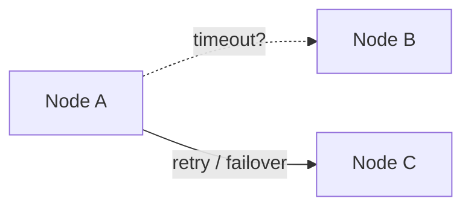

## Core ideas

Distributed systems fail **partially** and nondeterministically. Assume it.

- **Networks** — loss, delay, partitions; detect with timeouts (too short → cascading failure)
- **Clocks** — wall clock for dates (NTP, can jump); **monotonic** for durations; do not order events by wall time alone — use logical clocks
- **Truth** — a node cannot trust itself; use quorums; **fencing tokens** on locks/leases
- Byzantine faults are costly; inside a DC, checksums + validation usually suffice

Useful models: **partially synchronous** + **crash-recovery**. Distinguish **safety** (never wrong) vs **liveness** (eventually happens).

## Picture




## Example

### Prefer monotonic for elapsed time

```java
long start = System.nanoTime(); // monotonic-ish for measuring duration
doWork();
long elapsedNs = System.nanoTime() - start;

// System.currentTimeMillis() can jump backward/forward with NTP
```

### Fencing token

```java
void write(String key, byte[] value, long fencingToken) {
  if (fencingToken < store.currentFence(key)) {
    throw new StaleLockException();
  }
  store.put(key, value, fencingToken);
}
```

## Takeaways

- Timeouts are guesses — measure and adapt
- Wall clocks lie; causality needs logical tools
- Safety first; liveness may wait for majority recovery
