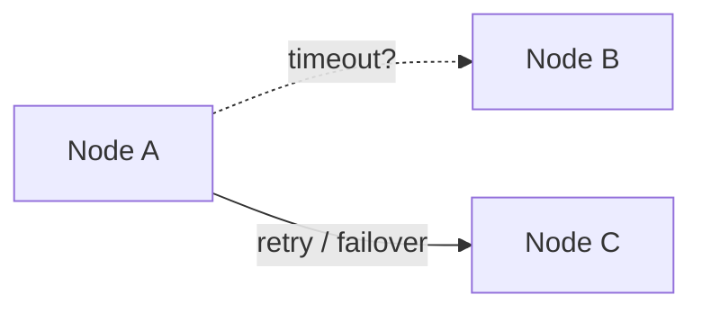
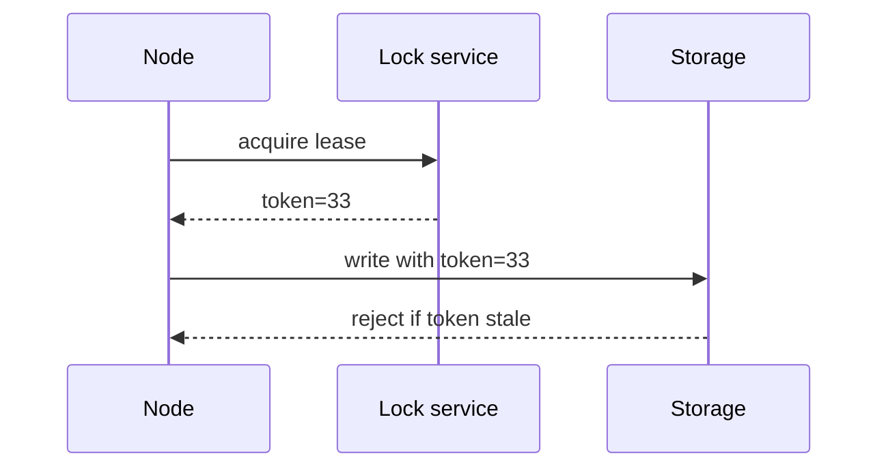

## What this chapter is about

A single computer is mostly all-or-nothing. A distributed system fails **partially** and nondeterministically. You must assume it will.

## Core ideas

### Partial failures

Some nodes work while others hang, lie about time, or disappear. Build fault tolerance by defining expected behavior under fault, enumerating failure modes, and injecting them in tests.

### Unreliable networks

Packets drop, delay, and reorder. Timeouts detect suspicion — not truth. Too-short timeouts cause cascading failure; too-long timeouts delay recovery. Prefer measuring real latency distributions over theoretical `2d + r` formulas. UDP can beat TCP when late data is worthless.

### Unreliable clocks

**Wall clocks** (NTP) jump and are unsafe for measuring elapsed time or ordering events alone. **Monotonic clocks** are for durations. Use logical clocks / version vectors for causality. GCP-style interval timestamps acknowledge uncertainty. GC pauses can freeze a thread mid-thought — designs must tolerate that.

### Knowledge, truth, and lies

A node cannot trust itself; majorities (quorums) decide. Locks/leases need **fencing tokens** so a zombie holder cannot corrupt shared resources. Full Byzantine fault tolerance is expensive; inside a DC, checksums and validation usually suffice.

Useful models: **partially synchronous** timing + **crash-recovery** nodes. Distinguish **safety** (never wrong) from **liveness** (eventually progresses).

## Visual





## Code Example

*Snippets below use Java, SQL, or plain text as labeled.*

Prefer monotonic elapsed time:

```java
long start = System.nanoTime();
doWork();
long elapsedNs = System.nanoTime() - start;
// currentTimeMillis() can jump with NTP
```

Fencing token:

```java
void write(String key, byte[] value, long fencingToken) {
  if (fencingToken < store.currentFence(key)) {
    throw new StaleLockException();
  }
  store.put(key, value, fencingToken);
}
```

## Takeaways

- Timeouts are guesses — measure and adapt
- Wall clocks lie; causality needs logical tools
- Safety first; liveness may wait for majority recovery
