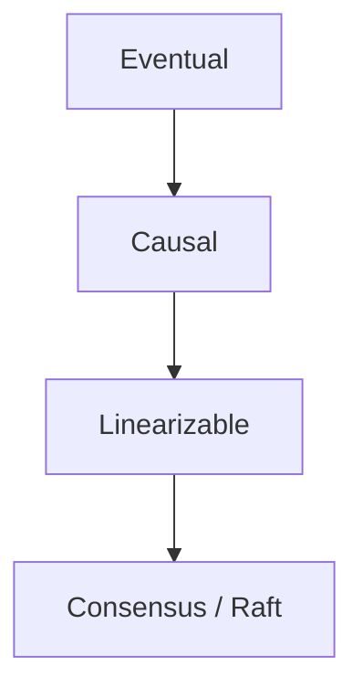
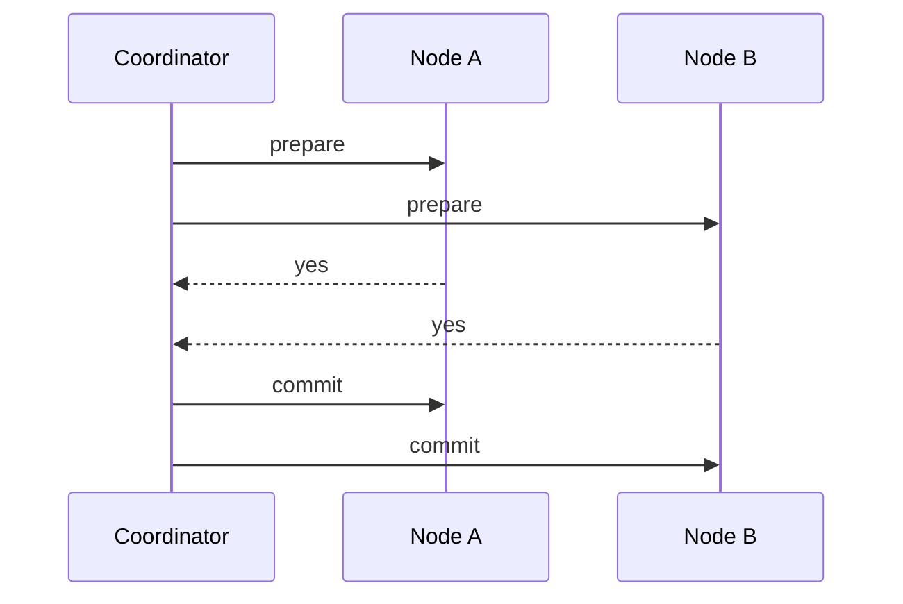

## Core ideas

Eventual consistency is easy to run and easy to misuse. Stronger models cost latency/availability.

- **Linearizability** — system behaves as one copy; recency guarantee (≠ serializability)
- **Causal consistency** — respect happens-before; strongest model that survives network delay without stalling like linearizability
- Order tools: version vectors, **Lamport timestamps**, **total order broadcast**
- **Consensus** — agree on a value (leader election, atomic commit). Practice uses Raft/Paxos/Zab under timeouts
- **2PC** — prepare then commit; coordinator failure can block; heavy operationally

CAP (informally): if you need linearizability during a partition, you sacrifice availability.

## Picture





## Example

### Linearizability vs serializability

```text
Linearizability: after any read sees x=2, all later reads see x>=2 (recency)
Serializability: transactions act as if run one-at-a-time (isolation)
```

### Lamport timestamp bump

```java
long onReceive(long remoteTs, long localTs) {
  return Math.max(remoteTs, localTs) + 1;
}
```

## Takeaways

- Linearizable ≠ serializable — different jobs
- Causal consistency is often the sweet spot for geo systems
- Consensus is powerful; majority + stable membership + timeout sensitivity
